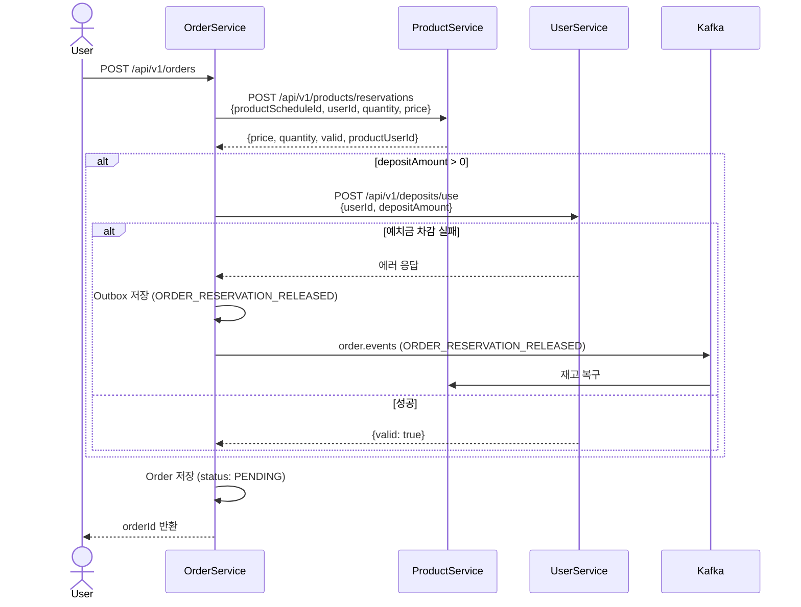

# 주문 생성

## 흐름

```
User → OrderService: POST /api/v1/orders
  │
  ├─ HTTP → ProductService: 재고 차감 + 가격 검증
  │    POST /api/v1/products/reservations
  │    요청: { productScheduleId, userId, quantity, price }
  │    응답: { price, quantity, valid, productUserId }
  │
  ├─ (depositAmount > 0) HTTP → UserService: 예치금 차감
  │    POST /api/v1/deposits/use
  │    요청: { userId, depositAmount }
  │    응답: { valid: true }
  │    실패 시 → Outbox 저장 (ORDER_RESERVATION_RELEASED)
  │             → OutboxPublisher → Kafka: order.events
  │             → ProductService: 재고 복구
  │
  └─ Order 저장 (status: PENDING) → orderId 반환
```



---

## 각 모듈 처리

### Order — `OrderService.create()`

1. 요청 검증
   - `quantity > 0`
   - `depositAmount >= 0`, `depositAmount <= totalAmount`
   - `productPrice >= 0`
2. ProductService HTTP 호출 — 재고 차감 + 가격 검증
3. `totalAmount = price × quantity` 계산
4. UserService HTTP 호출 — 예치금 차감 (`depositAmount == 0`이면 스킵)
   - 실패 시 Outbox에 `ORDER_RESERVATION_RELEASED` 저장 후 예외 throw
   - Kafka 직접 발행 대신 Outbox 경유: Kafka 장애 시에도 재고 해제 이벤트 유실 방지
   - 이 시점은 Order 저장 전이므로 이벤트 body의 `orderId`는 `null`

Kafka 이벤트 (보상 트랜잭션):
```
Topic:  order.events
Header: eventType = ORDER_RESERVATION_RELEASED
Body:   { "eventId": "UUID", "orderId": null, "productUserId": "UUID" }
```
5. Order 저장 (`PENDING`)

### Payment — `PaymentService.create()`

Order 생성 후 클라이언트가 호출. Payment 레코드 생성.

- `paymentAmount == 0` (예치금 100% 결제): PG 호출 없이 즉시 `PAYMENT_COMPLETED` Outbox 저장
- `paymentAmount > 0`: `READY` 상태로 저장, 이후 클라이언트가 `/confirm` 호출

### Product — `ScheduleService.verification()`

- 가격 검증: 클라이언트가 보낸 `price`와 상품 실제 가격 비교
- 재고 차감 (비관적 락)
- `ProductUser` 생성 (`RESERVED`)
- 응답: `{ price, quantity, valid: "OK" | "PRICE_MISMATCH" | "OUT_OF_STOCK", productUserId }`

### User (Deposit) — `UseDepositService.use()`

- 낙관적 락 (`@Version`)으로 잔액 확인 후 차감 (`deductDeposit`)
  - 예치금은 본인만 접근하여 충돌 빈도가 낮으므로 낙관적 락이 적합
  - 동시 충돌 시 `OptimisticLockException` → 트랜잭션 롤백 → HTTP 예외로 전파
- 잔액 부족 시 `DepositException` throw → HTTP 4xx → Order가 예외 수신
- `DepositHistory` 저장 (type: `PAYMENT`)

---

## 결과 상태

| 도메인 | 상태 |
|--------|------|
| `Order.status` | `PENDING` |
| `Payment.status` | `READY` (PG 결제) 또는 `DONE` (예치금 100%) |
| `ProductUser.status` | `RESERVED` |
| Schedule 잔여 인원 | 차감됨 |
