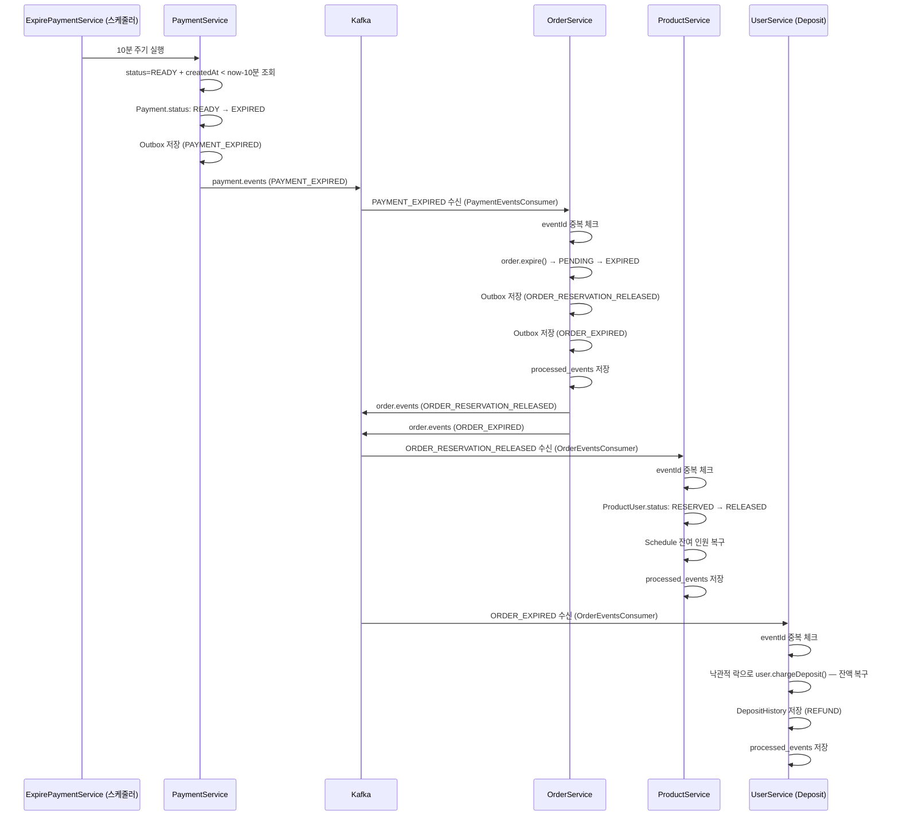

# 결제 미완료 (만료)

> 사용자가 결제를 진행하지 않거나 앱을 이탈한 경우.
> PaymentService 스케줄러가 생성 후 10분 경과한 READY 상태 Payment를 감지하여 만료 처리한다.

## 흐름

```
PaymentService: 스케줄러 (ExpirePaymentService) — 10분 주기
  Payment.status: READY → EXPIRED
  Outbox 저장 (PAYMENT_EXPIRED)
  └─ OutboxPublisher → Kafka: payment.events (PAYMENT_EXPIRED)
       └─ OrderService (PaymentEventsConsumer)
            eventId 중복 체크 → order.expire() → PENDING → EXPIRED
            Outbox 저장 (ORDER_RESERVATION_RELEASED)
            Outbox 저장 (ORDER_EXPIRED)
            processed_events 저장
            └─ OutboxPublisher → Kafka: order.events
                 ├─ ORDER_RESERVATION_RELEASED
                 │    └─ ProductService (OrderEventsConsumer)
                 │         eventId 중복 체크 → ProductUser.status: RESERVED → RELEASED
                 │         Schedule 잔여 인원 복구, processed_events 저장
                 └─ ORDER_EXPIRED
                      └─ UserService (OrderEventsConsumer)
                           eventId 중복 체크 → 예치금 복구, processed_events 저장
```



---

## 각 모듈 처리

### Payment — `ExpirePaymentService.execute()`

1. 스케줄러 실행 (10분 주기)
2. `status = READY` + `createdAt < now - 10분` 인 Payment 조회
3. `Payment.status → EXPIRED`
4. Outbox 저장 (`PAYMENT_EXPIRED`)

Kafka 이벤트:
```
Topic:  payment.events
Header: eventType = PAYMENT_EXPIRED
Body:   { "eventId": "UUID", "orderId": "UUID", "depositAmount": 5000 }
```

### Order — `PaymentEventsConsumer` → `OrderExpireHandler.expire()`

1. `PAYMENT_EXPIRED` 수신
2. `eventId` 기준 `processed_events` 조회 → 이미 존재하면 즉시 return
3. `order.getStatus() == EXPIRED`이면 return (상태 가드)
4. 하나의 트랜잭션으로 처리:
   - `order.expire()` → `PENDING → EXPIRED`
   - Outbox 저장 (`ORDER_RESERVATION_RELEASED`)
   - Outbox 저장 (`ORDER_EXPIRED`)
   - `processed_events` 저장

Kafka 이벤트:
```
Topic:  order.events
Header: eventType = ORDER_RESERVATION_RELEASED
Body:   { "eventId": "UUID", "orderId": "UUID", "productUserId": "UUID" }

Topic:  order.events
Header: eventType = ORDER_EXPIRED
Body:   { "eventId": "UUID", "orderId": "UUID", "userId": "UUID", "depositAmount": 5000 }
```

### Product — `OrderEventsConsumer` → `OrderEventHandler.handleReservationReleased()`

결제 실패(03)와 동일.

1. `ORDER_RESERVATION_RELEASED` 수신
2. `eventId` 기준 `processed_events` 조회 → 이미 존재하면 즉시 return
3. 하나의 트랜잭션으로 처리:
   - `scheduleUseCase.restoringInventory(RELEASED)` → Schedule 잔여 인원 복구, `ProductUser.status → RELEASED`
   - `processed_events` 저장

### User (Deposit) — `OrderEventsConsumer` → `RefundDepositService.refund()`

1. `ORDER_EXPIRED` 수신
2. `eventId` 기준 `processed_events` 조회 → 이미 존재하면 즉시 return
3. 하나의 트랜잭션으로 처리:
   - 낙관적 락으로 `user.chargeDeposit(depositAmount)` — 잔액 복구
   - `DepositHistory` 저장 (type: `REFUND`)
   - `processed_events` 저장

---

## 결과 상태

| 도메인 | 상태 |
|--------|------|
| `Payment.status` | `EXPIRED` |
| `Order.status` | `EXPIRED` |
| `ProductUser.status` | `RELEASED` |
| Schedule 잔여 인원 | 복구됨 |
| 예치금 잔액 | 복구됨 (사용한 경우) |
