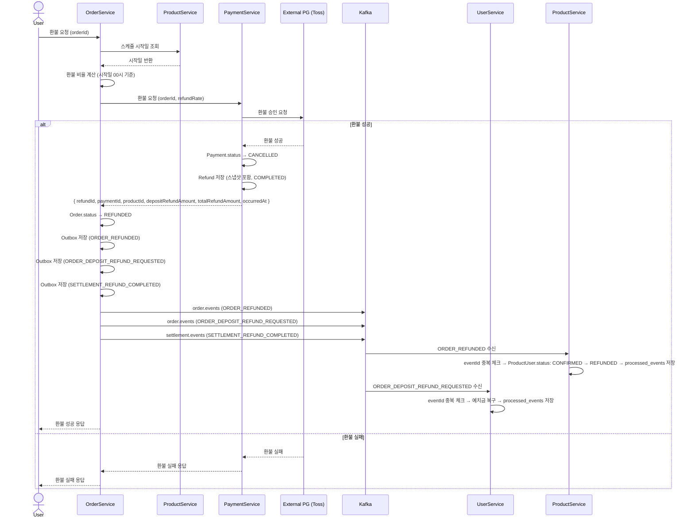

# 환불 흐름

## 환불 정책

스케줄 시작일 **00시 기준**으로 현재 시각과의 차이를 계산하여 환불 비율을 결정한다.

| 환불 시점 | 환불 비율 |
|-----------|-----------|
| 시작일 7일 초과 | 100% |
| 시작일 3일 초과 ~ 7일 이내 | 80% |
| 시작일 1일 초과 ~ 3일 이내 | 50% |
| 시작일 1일 이내 | 20% |
| 시작일 이후 | 0% (환불 불가) |

> 날짜 기준: 스케줄 시작일 당일 00시 (자정)

---

## 전체 흐름

```
User → OrderService: 환불 요청 (orderId)

OrderService → ProductService: 스케줄 시작일 조회 (HTTP)
ProductService → OrderService: 시작일 반환

OrderService: 환불 비율 계산 (시작일 00시 기준)
  └─ 환불금액 = 원본금액 × 환불비율
     ├─ paymentRefundAmount = 원본카드결제금액 × 비율
     └─ depositRefundAmount = 원본예치금 × 비율

OrderService → PaymentService: 환불 요청 (orderId, refundRate)

PaymentService → PG(Toss): 환불 승인 요청 (paymentKey, paymentRefundAmount)

alt 환불 성공
  PG → PaymentService: 환불 성공
  PaymentService: Payment.status → CANCELLED
  PaymentService: Refund 저장 (스냅샷 포함, COMPLETED)
  PaymentService → OrderService: 환불 성공 응답 (refundId, paymentId, productId, depositRefundAmount, totalRefundAmount, occurredAt)

  OrderService: Order.status → REFUNDED
  OrderService: Outbox 저장 (ORDER_REFUNDED)
  OrderService: Outbox 저장 (ORDER_DEPOSIT_REFUND_REQUESTED) [depositRefundAmount > 0]
  OrderService: Outbox 저장 (SETTLEMENT_REFUND_COMPLETED)

  OutboxPublisher → Kafka: order.events (ORDER_REFUNDED)
    └─ ProductService: eventId 중복 체크 → ProductUser.status: CONFIRMED → REFUNDED → processed_events 저장

  OutboxPublisher → Kafka: order.events (ORDER_DEPOSIT_REFUND_REQUESTED)
    └─ UserService: eventId 중복 체크 → 예치금 복구 (depositRefundAmount) → processed_events 저장

  OrderService → User: 환불 성공 응답

else 환불 실패
  PG → PaymentService: 환불 실패
  PaymentService: Refund 저장 (FAILED)
  PaymentService → OrderService: 환불 실패 응답
  OrderService → User: 환불 실패 응답
end
```

---

## 시퀀스 다이어그램



---

## Refund 테이블 변경

기존 `paymentRefundAmount`, `depositRefundAmount`, `totalRefundAmount`는 **환불 비율이 적용된 실제 환불 금액**을 저장한다.

추적을 위해 원본 금액과 적용된 비율을 스냅샷으로 추가 저장한다.

### 추가 필드

| 필드 | 타입 | 설명 |
|------|------|------|
| `original_payment_amount` | DECIMAL(19,2) | 원본 카드 결제 금액 (비율 적용 전) |
| `original_deposit_amount` | DECIMAL(19,2) | 원본 예치금 결제 금액 (비율 적용 전) |
| `refund_rate` | DECIMAL(5,2) | 적용된 환불 비율 (예: 0.50, 1.00) |

### 기존 필드 (변경된 의미)

| 필드 | 설명 |
|------|------|
| `payment_refund_amount` | 비율 적용 후 실제 카드 환불 금액 |
| `deposit_refund_amount` | 비율 적용 후 실제 예치금 환불 금액 |
| `total_refund_amount` | 비율 적용 후 총 환불 금액 |

---

## Kafka 신뢰성

결제 흐름과 동일하게 적용한다.

### Outbox 패턴

| EventType | 발행 서비스 | 토픽 | 발행 시점 |
|-----------|------------|------|-----------|
| `ORDER_REFUNDED` | OrderService | `order.events` | 주문 상태 REFUNDED 변경 |
| `SETTLEMENT_REFUND_COMPLETED` | OrderService | `settlement.events` | 환불 정산 타겟 적재 요청 |

### 멱등성

- UserService, ProductService 소비자에서 `eventId` 기반 `processed_events` 조회
- 이미 처리된 이벤트면 즉시 return

### DLQ

- `FixedBackOff(1000L, 3)` 재시도 후 `.dlq` 토픽으로 이동
- DLQ 적재 시 로그/알림 — 운영팀 수동 처리

---

## 각 모듈 처리

### OrderService

1. 환불 요청 수신 (orderId)
2. ProductService HTTP 호출 → 스케줄 시작일 조회
3. 시작일 00시 기준 환불 비율 계산
4. PaymentService HTTP 호출 → 환불 요청 (`orderId`, `refundRate` 전달)
5. 환불 성공 시 Order.status → `REFUNDED`
6. Outbox 저장 (`ORDER_REFUNDED`, `ORDER_DEPOSIT_REFUND_REQUESTED`, `SETTLEMENT_REFUND_COMPLETED`)
7. 환불 실패 시 에러 응답 반환

### PaymentService

1. 환불 요청 수신 (`orderId`, `refundRate`)
2. Payment 조회 → `PAID` 상태 검증
3. Refund 생성 (원본 금액 스냅샷 + 비율 저장, 상태: `PENDING`)
4. `paymentRefundAmount > 0`이면 PG 환불 호출
5. 성공: Payment.status → `CANCELLED`, Refund → `COMPLETED`, 상세 환불 응답 반환
6. 실패: Refund → `FAILED`, 에러 응답 반환

### UserService

1. `ORDER_REFUNDED` 수신
2. `eventId` 중복 체크
3. `user.chargeDeposit(depositRefundAmount)` — 예치금 복구
4. `DepositHistory` 저장 (type: `REFUND`)
5. `processed_events` 저장

### ProductService

1. `ORDER_REFUNDED` 수신
2. `eventId` 중복 체크
3. 재고 복구 (RESERVED → RELEASED)
4. `processed_events` 저장

---

## 결과 상태

| 도메인 | 상태 |
|--------|------|
| `Payment.status` | `CANCELLED` |
| `Order.status` | `REFUNDED` |
| `ProductUser.status` | `RELEASED` |
| Schedule 잔여 인원 | 복구됨 |
| 예치금 잔액 | 비율만큼 복구됨 |
