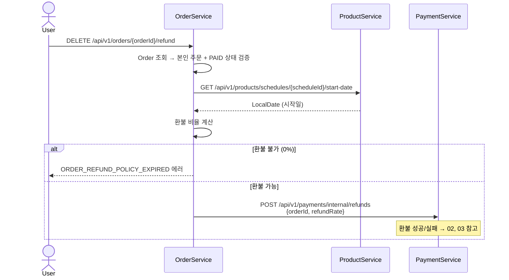

# 환불 요청

## 흐름

```
User → OrderService: DELETE /api/v1/orders/{orderId}/refund

OrderService
├─ Order 조회 → 본인 주문 + PAID 상태 검증
├─ HTTP → ProductService: 스케줄 시작일 조회
│    GET /api/v1/products/schedules/{scheduleId}/start-date
│    응답: LocalDate
├─ 환불 비율 계산 (시작일 00시 기준)
│    └─ 0%이면 → ORDER_REFUND_POLICY_EXPIRED 예외 반환
└─ HTTP → PaymentService: 환불 요청
     POST /api/v1/payments/internal/refunds
     요청: { orderId, refundRate }
     응답: { depositRefundAmount }
```



---

## 환불 비율 계산

`RefundPolicy.rateOf(days)` — `LocalDate.now()` 기준 시작일까지 남은 일수로 결정.

| 남은 일수 (`days`) | 환불 비율 |
|---------------------|-----------|
| `days > 7` | 100% |
| `days > 3` | 80% |
| `days > 1` | 50% |
| `days > 0` | 20% |
| `days <= 0` | 0% (환불 불가) |

> `ChronoUnit.DAYS.between(LocalDate.now(), startDate)` 사용 — 시작일 당일 00시 기준.

---

## 각 모듈 처리

### OrderService — `OrderService.refund()`

> `@Transactional` 없음 — 외부 HTTP 호출 포함이므로 커넥션 점유 방지

1. Order 조회
2. 본인 소유 검증: `order.isOwnedBy(userId)` — 위반 시 `ORDER_ACCESS_DENIED`
3. 상태 검증: `order.getStatus() == PAID` — 아니면 `ORDER_REFUND_NOT_ALLOWED`
4. ProductService HTTP 호출 → 스케줄 시작일 조회
5. 환불 비율 계산 → `0%`이면 `ORDER_REFUND_POLICY_EXPIRED`
6. PaymentService HTTP 호출 → 환불 요청 (orderId, refundRate 전달)
7. 성공 응답 수신 → `OrderRefundHandler.onSuccess()` 호출 (트랜잭션 분리)

### ProductService — `ScheduleService.getScheduleStartDate()`

- Schedule 엔티티 조회 → `scheduleDt` 반환
- 조회 전용, 별도 상태 변경 없음

### PaymentService — `PaymentService.refundByOrder()`

> `@Transactional` 없음 — PG 외부 호출 포함

- orderId 기준 Payment 조회
- `payment.isDone()` 검증
- `paymentRefundAmount = paymentAmount × refundRate` 계산
- `paymentRefundAmount > 0`이면 PG 환불 호출
- 이후 처리는 02-refund-success, 03-refund-failed 참고