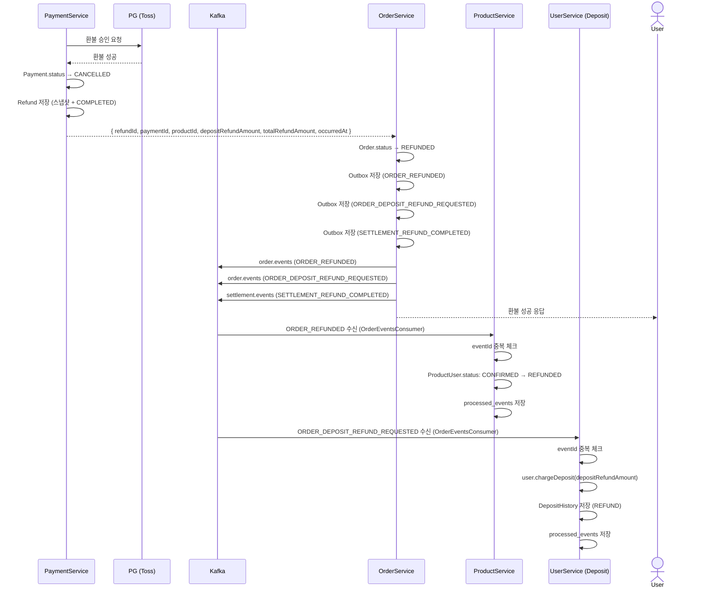

# 환불 성공

## 흐름

```
PaymentService: PG 환불 승인 성공
  └─ PaymentRefundHandler.onSuccess() [트랜잭션]
       ├─ Payment.status → CANCELLED
       ├─ Refund 저장 (원본 금액 스냅샷 + refundRate + COMPLETED)
       └─ 환불 상세 응답 생성
            └─ { refundId, paymentId, productId, depositRefundAmount, totalRefundAmount, occurredAt }

PaymentService → OrderService: 환불 상세 응답 반환

OrderService
└─ OrderRefundHandler.onSuccess() [트랜잭션]
     ├─ Order.status → REFUNDED
     ├─ Outbox 저장 (ORDER_REFUNDED)
     │    └─ OutboxPublisher → Kafka: order.events (ORDER_REFUNDED)
     │         └─ ProductService (OrderEventsConsumer)
     │              eventId 중복 체크 → ProductUser.status: CONFIRMED → REFUNDED
     │              processed_events 저장
     ├─ Outbox 저장 (ORDER_DEPOSIT_REFUND_REQUESTED) [depositRefundAmount > 0]
     │    └─ OutboxPublisher → Kafka: order.events (ORDER_DEPOSIT_REFUND_REQUESTED)
     │         └─ UserService (OrderEventsConsumer)
     │              eventId 중복 체크 → 예치금 복구 → processed_events 저장
     └─ Outbox 저장 (SETTLEMENT_REFUND_COMPLETED)
          └─ OutboxPublisher → Kafka: settlement.events (SETTLEMENT_REFUND_COMPLETED)
               └─ settlement-service
                    sourceEventId 유니크 제약으로 멱등 적재

OrderService → User: 환불 성공 응답
```



---

## 각 모듈 처리

### PaymentService — `PaymentRefundHandler.onSuccess()`

> 하나의 트랜잭션 (`@Transactional`)

1. Payment 조회
2. `payment.markCancelled()` → `DONE → CANCELLED`
3. 환불 금액 계산
   - `paymentRefundAmount = paymentAmount × refundRate`
   - `depositRefundAmount = depositAmount × refundRate`
4. `Refund.create()` — 원본 금액 스냅샷 포함
   - `originalPaymentAmount`, `originalDepositAmount`, `refundRate` 저장
5. `refund.markCompleted()` → `COMPLETED`
6. `InternalRefundResponseDto` 반환 → OrderService로 전달

### OrderService — `OrderRefundHandler.onSuccess()`

> 하나의 트랜잭션 (`@Transactional`)

1. Order 조회
2. 이미 `REFUNDED`이면 즉시 return (멱등성)
3. `order.refund()` → `PAID → REFUNDED`
4. Outbox 저장 (`ORDER_REFUNDED`) — Product 재고 복구 트리거
5. `depositRefundAmount > 0`이면 Outbox 저장 (`ORDER_DEPOSIT_REFUND_REQUESTED`) — User 예치금 복구 트리거
6. Outbox 저장 (`SETTLEMENT_REFUND_COMPLETED`) — settlement 정산 타겟 적재 트리거

Kafka 이벤트:
```
Topic:  order.events
Header: eventType = ORDER_REFUNDED
Body:   { "eventId": "UUID", "orderId": "UUID", "productUserId": "UUID" }

Topic:  order.events
Header: eventType = ORDER_DEPOSIT_REFUND_REQUESTED
Body:   { "eventId": "UUID", "orderId": "UUID", "userId": "UUID", "depositAmount": ... }

Topic:  settlement.events
Header: eventType = SETTLEMENT_REFUND_COMPLETED
Body:   { "eventId": "UUID", "orderId": "UUID", "paymentId": "UUID", "refundId": "UUID", "sellerId": "UUID", "productId": "UUID", "settlementBaseAmount": ..., "occurredAt": "..." }
```

### ProductService — `OrderEventsConsumer` → `OrderEventHandler.handleOrderRefunded()`

1. `ORDER_REFUNDED` 수신
2. `eventId` 기준 `processed_events` 조회 → 이미 존재하면 즉시 return
3. 하나의 트랜잭션으로 처리:
   - `scheduleUseCase.restoringInventory(productUserId, REFUNDED)` → `ProductUser.status → REFUNDED`
   - `processed_events` 저장

### UserService — `OrderEventsConsumer` → `RefundDepositService.refund()`

1. `ORDER_DEPOSIT_REFUND_REQUESTED` 수신
2. `eventId` 기준 `processed_events` 조회 → 이미 존재하면 즉시 return
3. 하나의 트랜잭션으로 처리:
   - `user.chargeDeposit(depositRefundAmount)` — 예치금 복구
   - `DepositHistory` 저장 (type: `REFUND`)
   - `processed_events` 저장

---

## 결과 상태

| 도메인 | 상태 |
|--------|------|
| `Payment.status` | `CANCELLED` |
| `Refund.status` | `COMPLETED` |
| `Order.status` | `REFUNDED` |
| `ProductUser.status` | `REFUNDED` |
| `SettlementTarget` | `REFUND` 타입 정산 타겟 적재 |
| Schedule 잔여 인원 | 복구됨 |
| 예치금 잔액 | 비율만큼 복구됨 |
