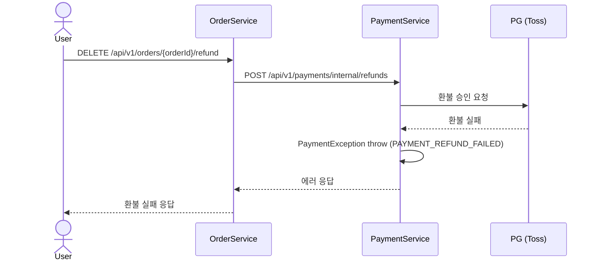

# 환불 실패

> PG 환불 요청이 거절되거나 네트워크 오류가 발생한 경우.

## 흐름

```
PaymentService: PG 환불 실패
  └─ PaymentException throw
       └─ OrderService: 예외 수신 → 환불 실패 응답 반환

Order.status 변경 없음 (PAID 유지)
재고 / 예치금 변경 없음
```



---

## 각 모듈 처리

### PaymentService — `PaymentService.refundByOrder()` 예외 처리

1. PG 환불 실패 — `PaymentGatewayException` 발생
2. `catch (Exception e)` → `PaymentException(PAYMENT_REFUND_FAILED)` throw
3. DB 변경 없음 — `PaymentRefundHandler.onSuccess()`가 호출되지 않으므로 트랜잭션 자체가 없음
4. HTTP 에러 응답 반환 → OrderService로 전파

> PG 호출과 DB 처리를 분리한 이유: PG 호출 후 `onSuccess()`에서 DB를 변경하므로, PG 실패 시 DB는 건드리지 않은 상태. 별도 롤백 처리 불필요.

### OrderService

1. PaymentService HTTP 호출 실패 → 예외 수신
2. `OrderRefundHandler.onSuccess()` 미호출 → Order 상태 변경 없음
3. 클라이언트에 환불 실패 에러 응답 반환

---

## 결과 상태

| 도메인 | 상태 |
|--------|------|
| `Payment.status` | `DONE` (변경 없음) |
| `Refund` | 생성 안됨 |
| `Order.status` | `PAID` (변경 없음) |
| `ProductUser.status` | `CONFIRMED` (변경 없음) |
| Schedule 잔여 인원 | 유지 |
| 예치금 잔액 | 유지 |

> 환불 실패 시 모든 상태가 원래대로 유지되므로, 사용자는 재시도 가능.