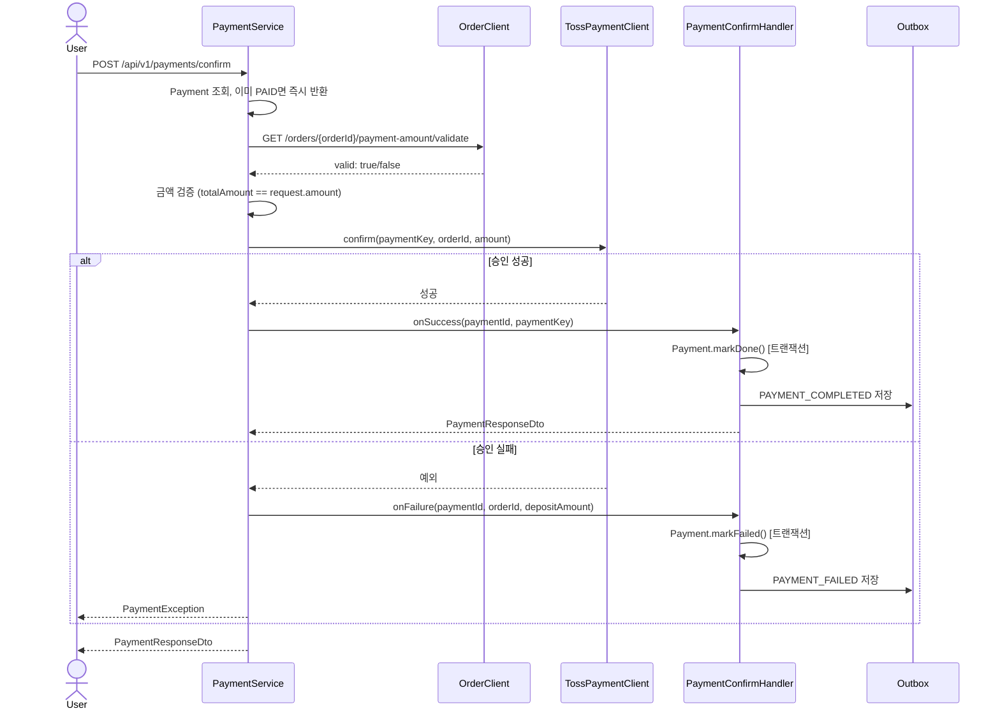
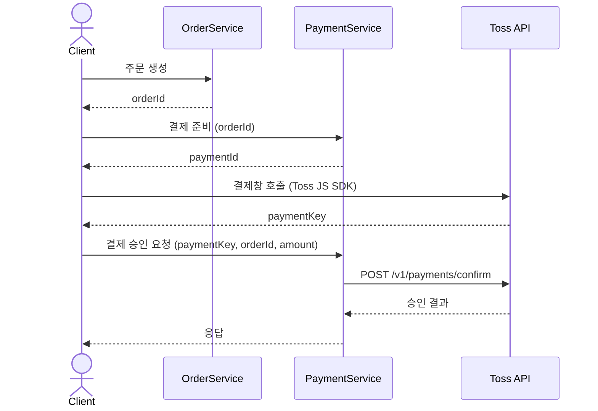

# Payment 서비스 구조 및 흐름

## 배경 및 목적

`payment` 서비스는 결제 도메인의 중심 서비스로, PG(Toss Payments) 연동, 결제 만료 처리, 환불, 예치금 결제까지 담당한다.

| 항목 | 역할 |
|------|------|
| 결제 준비 | Payment 레코드 생성, 예치금 100% 결제 즉시 완료 처리 |
| 결제 승인 | PG confirm 호출, 금액 검증, 상태 변경 |
| 결제 만료 | 스케줄러가 10분 경과 READY 결제 감지 후 EXPIRED 처리 |
| 환불 | PG 환불 호출, 상태 변경, 이벤트 발행 |
| 이벤트 발행 | Outbox 패턴으로 payment.events 토픽에 발행 |
| 정산 연동 | 결제/환불 정산 대상 슬라이스 조회 |

---

## 도메인 상태값

### Payment — `PaymentStatus`

| 상태 | 진입 조건 |
|------|-----------|
| `READY` | Payment 생성 직후 (PG 결제 대기) |
| `PAID` | PG 승인 성공 또는 예치금 100% 결제 |
| `FAILED` | PG 승인 실패 |
| `EXPIRED` | 스케줄러가 생성 후 10분 경과 감지 |
| `CANCELLED` | 환불 완료 |

### Refund — `RefundStatus`

| 상태 | 진입 조건 |
|------|-----------|
| `PENDING` | 환불 레코드 생성 직후 |
| `COMPLETED` | PG 환불 성공 |
| `FAILED` | PG 환불 실패 |

### DepositPayment — `DepositPaymentStatus`

| 상태 | 진입 조건 |
|------|-----------|
| `PENDING` | 예치금 충전 요청 직후 |
| `DONE` | PG 승인 성공 |
| `FAILED` | PG 승인 실패 |

---

## 패키지 구조 및 계층 역할

```
presentation/controller/
  PaymentController.java          — 결제 준비/승인/환불
  PaymentInternalController.java  — 정산용 내부 API
  DepositPaymentController.java   — 예치금 충전

application/service/
  PaymentService.java             — 결제 준비, 승인 오케스트레이션, 환불, 정산 조회
  ExpirePaymentService.java       — 만료 스케줄러
  DepositPaymentService.java      — 예치금 충전 결제
  handler/
    PaymentConfirmHandler.java    — 승인 성공/실패 후 @Transactional 처리

application/port/external/
  PaymentGatewayPort.java         — PG 연동 인터페이스
  OrderPort.java                  — Order 서비스 연동 인터페이스
  UserPort.java                   — User 서비스 연동 인터페이스

domain/model/
  Payment.java                    — 결제 엔티티 (상태 전이 메서드 포함)
  Refund.java                     — 환불 엔티티
  DepositPayment.java             — 예치금 충전 엔티티

infrastructure/external/
  toss/TossPaymentClient.java     — PG 실제 HTTP 클라이언트 (PaymentGatewayPort 구현)
  order/OrderClient.java          — Order 서비스 HTTP 클라이언트 (OrderPort 구현)
  user/UserClient.java            — User 서비스 HTTP 클라이언트 (UserPort 구현)

infrastructure/outbox/
  OutboxEvent.java                — Outbox 이벤트 엔티티
  OutboxPublisher.java            — 1초 주기 스케줄러, Kafka 발행
  OutboxService.java              — 상태 전이 (PENDING→SENDING→PUBLISHED/FAILED)
```

---

## 핵심 서비스별 책임

### PaymentService

| 기능 | 설명 |
|------|------|
| 결제 준비 (`create`) | Payment 생성, 예치금 100%면 즉시 PAID + PAYMENT_COMPLETED Outbox 저장 |
| 결제 승인 (`confirm`) | Order 금액 검증 → PG confirm → 핸들러 위임 (tx 없음) |
| 환불 (`refund`) | PAID 검증 → Refund 생성 → PG 환불 → CANCELLED + 상세 환불 응답 반환 |
| 정산 조회 | 결제/환불 슬라이스 커서 페이지네이션 |

### PaymentConfirmHandler

PG 호출 결과에 따라 독립된 트랜잭션으로 DB 상태를 변경한다.

| 메서드 | 처리 내용 |
|--------|-----------|
| `onSuccess` | Payment.markDone() + PAYMENT_COMPLETED Outbox 저장 |
| `onFailure` | Payment.markFailed() + PAYMENT_FAILED Outbox 저장 |

> PaymentService.confirm()은 `@Transactional` 없이 PG 외부 호출을 수행하고, 결과에 따라 핸들러를 호출한다. 핸들러만 `@Transactional`을 가져 외부 호출과 DB 트랜잭션을 분리한다.

### ExpirePaymentService

| 기능 | 설명 |
|------|------|
| 만료 처리 (`execute`) | `READY` + `createdAt < now - 10분` 조회 → expire() + PAYMENT_EXPIRED Outbox 저장 |

스케줄러 주기는 `PaymentCleanupScheduler`에서 설정한다.

---

## 주요 요청 흐름

### 결제 준비 (prepare)

```
PaymentController.create()
  → PaymentService.create()
    → Payment.create() 생성
    → paymentAmount == 0 이면 markDone("DEPOSIT_ONLY")
    → paymentRepository.save()
    → paymentAmount == 0 이면 OutboxEvent(PAYMENT_COMPLETED) 저장
    → PaymentResponseDto 반환
```

### 결제 승인 (confirm)



### 환불 (refund)

```
PaymentController.refund()
  → PaymentService.refund()
    → Payment 조회 (PAID 검증)
    → Refund.create() 저장 (PENDING)
    → paymentAmount > 0 이면 PG 환불 호출
    → Payment.markCancelled() / Refund.markCompleted()
    → InternalRefundResponseDto(refundId, paymentId, productId, depositRefundAmount, totalRefundAmount, occurredAt) 반환
    실패 시 → Refund.markFailed()
```

### 결제 만료 (expire scheduler)

```
ExpirePaymentService.execute() [10분 주기]
  → READY + createdAt < now-10분 조회
  → 각 Payment 순회
    → payment.expire() → READY → EXPIRED
    → OutboxEvent(PAYMENT_EXPIRED) 저장
```

---

## PG 연동 (Toss Payments)



---

## 외부 서비스 연동

### Order 서비스 — `OrderClient` (`OrderPort` 구현)

| 메서드 | 엔드포인트 | 용도 |
|--------|-----------|------|
| `validateOrder` | `GET /api/v1/orders/{orderId}/payment-amount/validate` | 결제 승인 전 금액 검증 |
> 현재 결제 결과 반영은 HTTP 내부 호출이 아니라 Kafka(`payment.events`)로만 전달한다.

### User 서비스 — `UserClient` (`UserPort` 구현)

| 메서드 | 엔드포인트 | 용도 |
|--------|-----------|------|
| `increaseDeposit` | `PUT /api/v1/deposits/internal/users/{userId}/deposit` | 예치금 충전 완료 후 잔액 증가 |

---

## Outbox 패턴

결제 이벤트는 Kafka에 직접 발행하지 않고 `payment_outbox_events` 테이블에 먼저 저장한다.

```
[트랜잭션] 상태 변경 + OutboxEvent 저장 → 원자적 커밋
[OutboxPublisher 스케줄러 — 1초 주기]
  → PENDING/SENDING 이벤트 조회 (FOR UPDATE SKIP LOCKED)
  → PENDING → SENDING 상태 전이
  → Kafka 발행 (kafkaTemplate.send().get())
  → 성공: SENDING → PUBLISHED
  → 실패: retry_count++ / 임계값 초과 시 FAILED
```

### Outbox 이벤트 상태

| 상태 | 의미 |
|------|------|
| `PENDING` | 저장됨, 아직 미발행 |
| `SENDING` | 발행 시도 중 (인스턴스 선점) |
| `PUBLISHED` | Kafka 발행 완료 |
| `FAILED` | 재시도 초과, 수동 처리 필요 |

### 발행 이벤트 목록

| EventType | 발행 시점 | 토픽 |
|-----------|-----------|------|
| `PAYMENT_COMPLETED` | PG 승인 성공 / 예치금 100% 결제 | `payment.events` |
| `PAYMENT_FAILED` | PG 승인 실패 | `payment.events` |
| `PAYMENT_EXPIRED` | 10분 경과 만료 | `payment.events` |

> 이벤트 페이로드 상세는 `docs/kafka-topics.md` 참고.
