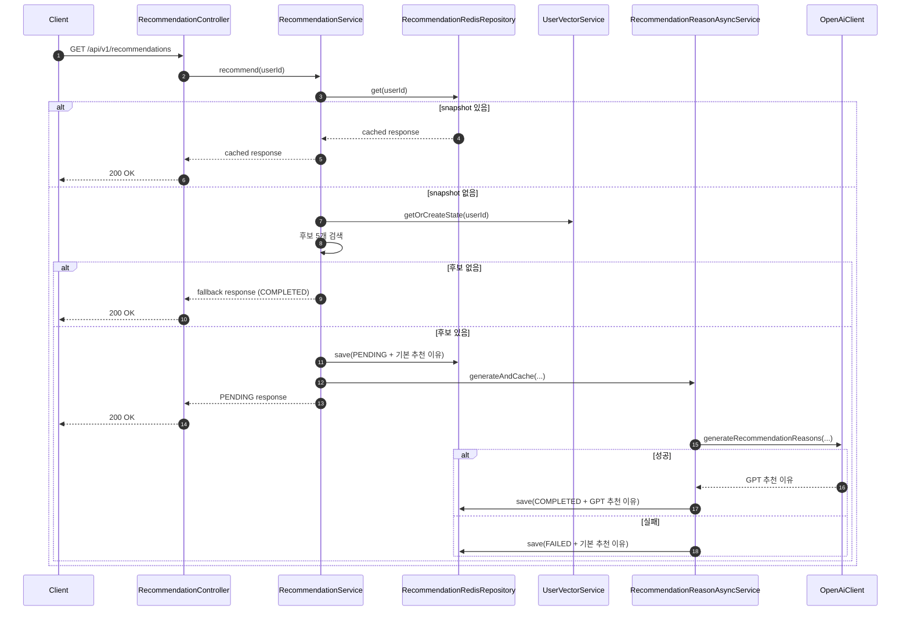

# AI 추천 기능 흐름

## 핵심 클래스

- `RecommendationController`
  - 추천 API 진입점
  - 같은 API polling의 진입점

- `RecommendationService`
  - recommendation snapshot 조회
  - snapshot miss 시 userVector 상태 조회, 후보 검색, `PENDING` 응답 생성

- `RecommendationReasonAsyncService`
  - OpenAI 추천 이유 비동기 생성
  - snapshot을 `COMPLETED` 또는 `FAILED`로 갱신

- `UserActivityService`
  - 행동 로그 저장
  - recommendation snapshot 삭제
  - userVector 증분 업데이트 호출

- `UserVectorService`
  - Redis user profile / exclude 조회
  - 캐시 miss 시 full rebuild
  - 행동 이벤트 기반 증분 업데이트

## 추천 요청 흐름

단계별 설명:

1. `RecommendationService`는 recommendation snapshot을 먼저 확인합니다.
2. snapshot이 있으면 `PENDING`, `COMPLETED`, `FAILED` 현재 값을 그대로 반환합니다.
3. snapshot이 없으면 `UserVectorService`에서 `userVector + excludedProductIds`를 가져옵니다.
4. 후보가 있으면 기본 추천 이유로 `PENDING` snapshot을 저장하고 즉시 반환합니다.
5. `RecommendationReasonAsyncService`가 별도 스레드에서 OpenAI 추천 이유 생성을 수행합니다.
6. 성공하면 snapshot을 `COMPLETED`로, 실패하면 `FAILED`로 갱신합니다.
7. 후보가 없으면 인기 상품 fallback을 `COMPLETED` 상태로 반환합니다.

프론트 연동 포인트:

- 첫 응답은 `PENDING`일 수 있으므로 기본 추천 이유를 먼저 보여줍니다.
- 이후 동일 API를 polling 하면서 `COMPLETED` 또는 `FAILED`로 바뀌는지 확인합니다.
- 현재 프론트 정책은 `1.5초` 간격, 최대 `5회` polling 입니다.

## 데이터 적재 흐름

1. product / order 서비스가 행동 이벤트 발행
2. `UserActivityService`가 `user_activities`에 로그 저장
3. 해당 유저 recommendation snapshot 삭제
4. `UserVectorService.updateOnActivity()`가 Redis profile / exclude를 갱신
5. profile이 없거나 버전이 다르면 `user_activities` 기준 full rebuild

제외 정책:

- `VIEW`는 userVector에는 반영하지만 추천 후보에서는 제외하지 않습니다.
- `WISHLIST`, `ORDER`만 추천 후보에서 제외합니다.

## 한 줄 요약

이 추천 기능은 `userVector`를 Redis 상태로 유지하면서, 추천 결과는 polling 동안만 snapshot으로 고정하고, 추천 이유는 `PENDING -> COMPLETED/FAILED` 2-phase로 비동기 생성하는 구조입니다.
