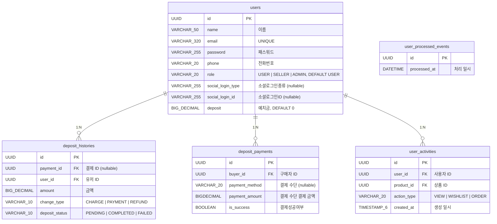
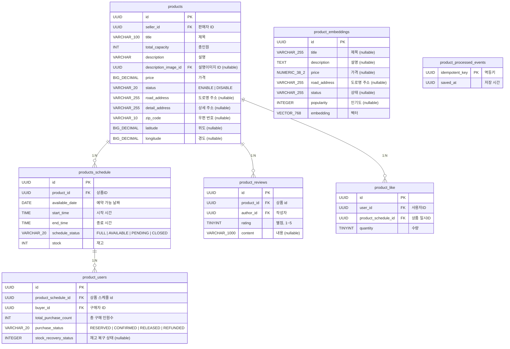
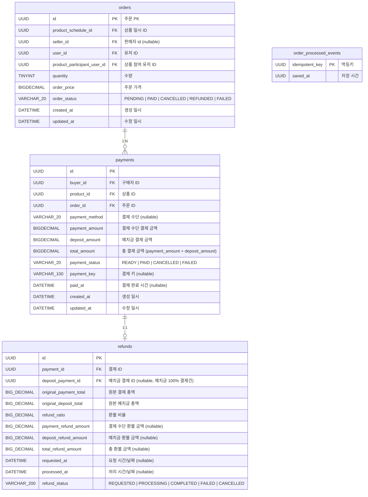
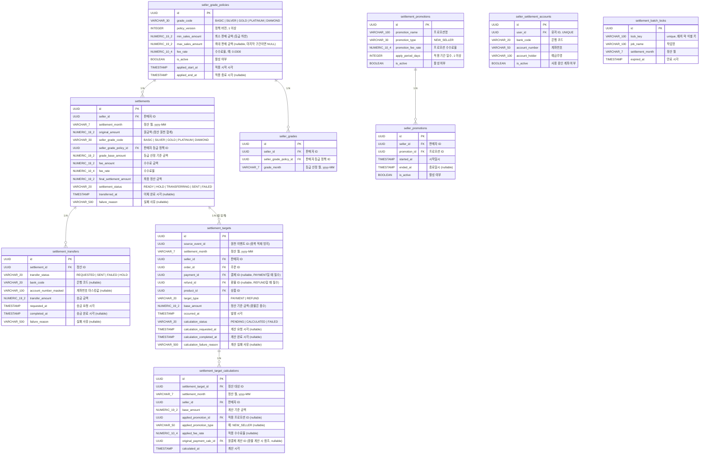
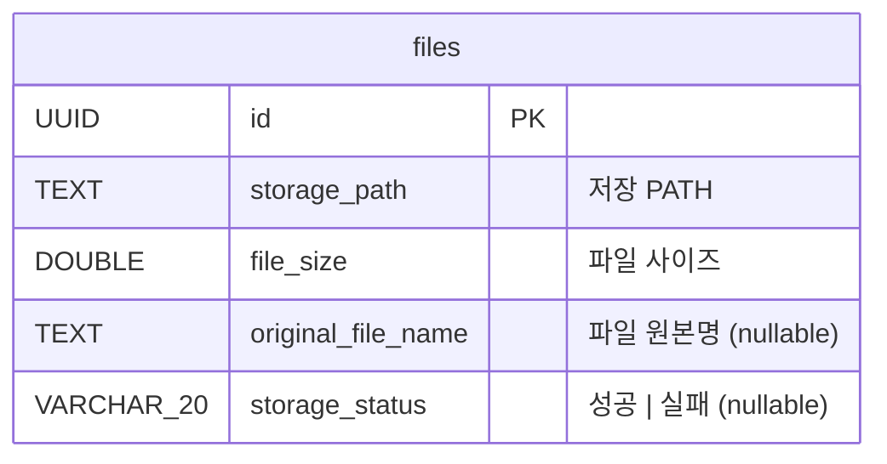

# 잡아클래스 ERD 문서

## 목차

1. [ERD Cloud 원본](#1-erd-cloud-원본)
2. [Mermaid ERD 상세](#2-mermaid-erd-상세)
    - [User / Deposit 서비스](#21-user--deposit-서비스)
    - [Product 서비스](#22-product-서비스)
    - [Order / Payment / Refund 서비스](#23-order--payment--refund-서비스)
    - [Settlement 서비스](#24-settlement-서비스)
    - [File 서비스](#25-file-서비스)
    - [Outbox / 멱등성 이벤트 테이블](#26-outbox--멱등성-이벤트-테이블)

---

## 1. ERD 원본

> ERD : [ERD.md](ERD.md)

---

## 2. Mermaid ERD 상세

> **표기 규칙**
> - `PK` : Primary Key
> - `FK` : Foreign Key (논리적 참조, 물리적 FK 미설정)
> - ENUM 값은 컬럼 주석에 명시

---

### 2.1 User / Deposit 서비스

---

### 2.2 Product 서비스

---

### 2.3 Order / Payment / Refund 서비스

---

### 2.4 Settlement 서비스

---

### 2.5 File 서비스

---

### 2.6 Outbox / 멱등성 이벤트 테이블

> 각 서비스의 Transactional Outbox 패턴 및 Kafka 멱등성 처리용 테이블

```mermaid
erDiagram
    order_outbox_events {
        UUID id PK
        VARCHAR aggregate_type "애그리거트 유형"
        VARCHAR aggregate_id "애그리거트 ID"
        VARCHAR event_type "이벤트 타입"
        TEXT event_body "이벤트 본문"
        VARCHAR outbox_status "PENDING | SENDING | PUBLISHED | FAILED"
        INTEGER retry_count "재시도 횟수"
        DATETIME last_tried_at "마지막 시도 일시"
        DATETIME created_at "생성 일시"
        DATETIME updated_at "수정 일시"
    }

    payment_outbox_events {
        UUID id PK
        VARCHAR aggregate_type "애그리거트 유형"
        VARCHAR aggregate_id "애그리거트 ID"
        VARCHAR event_type "이벤트 타입"
        TEXT event_body "이벤트 본문"
        VARCHAR outbox_status "PENDING | SENDING | PUBLISHED | FAILED"
        INTEGER retry_count "재시도 횟수"
        DATETIME last_tried_at "마지막 시도 일시"
        DATETIME created_at "생성 일시"
        DATETIME updated_at "수정 일시"
    }

    product_outbox_events {
        UUID id PK
        VARCHAR aggregate_type "애그리거트 유형"
        VARCHAR aggregate_id "애그리거트 ID"
        VARCHAR event_type "이벤트 타입 (EsEventType)"
        LOB event_body "이벤트 본문"
        VARCHAR outbox_status "OutboxStatus"
        INTEGER retry_count "재시도 횟수"
        DATETIME last_tried_at "마지막 시도 일시"
        DATETIME created_at "생성 일시"
        DATETIME updated_at "수정 일시"
        DATETIME deleted_at "삭제 일시"
    }

    admin_outbox_events {
        UUID id PK
        VARCHAR aggregate_type "애그리거트 유형"
        VARCHAR aggregate_id "애그리거트 ID"
        VARCHAR event_type "이벤트 타입 (EsEventType)"
        LOB event_body "이벤트 본문"
        VARCHAR outbox_status "OutboxStatus"
        INTEGER retry_count "재시도 횟수"
        DATETIME last_tried_at "마지막 시도 일시"
        DATETIME created_at "생성 일시"
        DATETIME updated_at "수정 일시"
    }

    order_processed_events {
        UUID idempotent_key PK "멱등키"
        UUID saved_at "저장 시간"
    }

    product_processed_events {
        UUID idempotent_key PK "멱등키"
        UUID saved_at "저장 시간"
    }

    user_processed_events {
        UUID id PK
        DATETIME processed_at "처리 일시"
    }
```

---

## 서비스별 테이블 매핑 요약

| 서비스        | 테이블                                                                                                                                                                                                                                           |
|------------|-----------------------------------------------------------------------------------------------------------------------------------------------------------------------------------------------------------------------------------------------|
| user       | `users`, `user_activities`, `user_processed_events`                                                                                                                                                                                           |
| deposit    | `deposit_histories`, `deposit_payments`                                                                                                                                                                                                       |
| product    | `products`, `products_schedule`, `product_users`, `product_reviews`, `product_like`, `product_embeddings`, `product_processed_events`                                                                                                         |
| order      | `orders`, `order_processed_events`                                                                                                                                                                                                            |
| payment    | `payments`, `refunds`                                                                                                                                                                                                                         |
| settlement | `settlements`, `settlement_transfers`, `settlement_targets`, `settlement_target_calculations`, `seller_grade_policies`, `seller_grades`, `settlement_promotions`, `seller_promotions`, `seller_settlement_accounts`, `settlement_batch_locks` |
| file       | `files`                                                                                                                                                                                                                                       |
| outbox     | `order_outbox_events`, `payment_outbox_events`, `product_outbox_events`, `admin_outbox_events`                                                                                                                                                |
