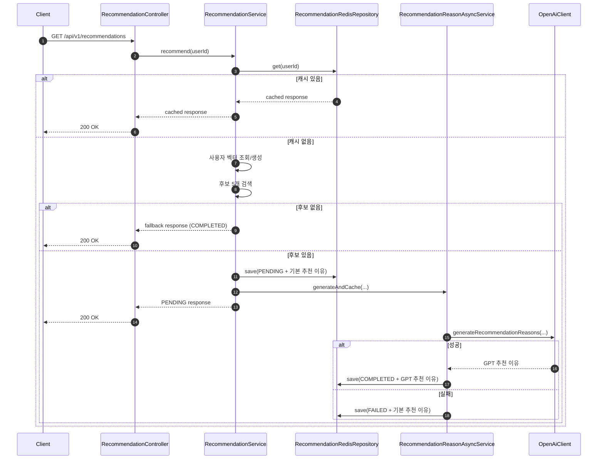

# AI 추천 기능 흐름

## 핵심 클래스

- `RecommendationController`
  - 추천 API 진입점
  - 현재 사용자 ID를 받아 추천 유스케이스 호출
  - 같은 API를 polling해서 상태를 확인하는 진입점

- `RecommendationService`
  - 추천 기능의 메인 오케스트레이터
  - 캐시 조회, 사용자 벡터 조회, 후보 검색, `PENDING` 응답 생성 담당

- `RecommendationReasonAsyncService`
  - 추천 이유 생성 비동기 워커
  - OpenAI 호출 후 캐시를 `COMPLETED` 또는 `FAILED`로 갱신

- `ProductAiEventsConsumer`
  - `product.events` Kafka 토픽 소비
  - 상품 임베딩 갱신, 삭제, 사용자 조회 이력 적재 처리

- `ProductEmbeddingSyncService`
  - 상품 정보를 임베딩으로 변환
  - 임베딩 저장/수정/삭제 담당

- `UserActivityService`
  - 상품 조회 이벤트를 사용자 활동 데이터로 저장

- `UserVectorService`
  - 사용자 활동 기반 벡터 조회/생성 담당
  - 반복 VIEW 상한과 최근성 감쇠를 적용해 사용자 벡터 구성

## 추천 요청 흐름

### 2-Phase 구조

### 단계별 설명

1. `RecommendationController`가 추천 요청을 받습니다.
2. `RecommendationService`가 추천 캐시를 먼저 확인합니다.
3. 캐시가 있으면 `PENDING`, `COMPLETED`, `FAILED` 상태 중 현재 값을 그대로 반환합니다.
4. 캐시가 없으면 `UserVectorService`로 사용자 벡터를 조회 또는 생성합니다.
5. `CandidateSearchRepository`로 벡터 기반 후보 상품을 검색합니다.
6. 후보가 있으면 기본 추천 이유로 `PENDING` 응답을 만들고 먼저 캐시에 저장합니다.
7. `RecommendationReasonAsyncService`가 별도 스레드에서 OpenAI 추천 이유 생성을 수행합니다.
8. 성공하면 캐시를 `COMPLETED`로, 실패하면 `FAILED`로 갱신합니다.
9. 클라이언트는 같은 API를 polling 하면서 최종 상태를 확인합니다.
10. 후보가 없으면 인기 상품 기반 fallback을 `COMPLETED` 상태로 반환합니다.

프론트 연동 포인트:

- 첫 응답은 `PENDING`일 수 있으므로 기본 추천 이유를 바로 보여줄 수 있어야 합니다.
- 이후 동일 API를 다시 호출해 `COMPLETED` 또는 `FAILED`로 상태가 바뀌는지 확인합니다.
- 현재 프론트는 `1.5초` 간격으로 최대 `5회` polling 합니다.

## 데이터 적재 흐름

1. product 서비스가 `product.events` 발행
2. `ProductAiEventsConsumer`가 이벤트 수신
3. `PRODUCT_AI_SYNCED`
   - `ProductEmbeddingSyncService`가 상품 임베딩 저장/갱신
4. `PRODUCT_DELETED`
   - 상품 임베딩 삭제
5. `PRODUCT_VIEWED`
   - `UserActivityService`가 사용자 조회 이력 저장
   - 캐시는 즉시 무효화하지 않고 TTL에 맡김

## 한 줄 요약

이 추천 기능은 추천 후보를 먼저 빠르게 반환하고, 추천 이유 생성은 비동기로 처리한 뒤 같은 캐시 값을 `PENDING -> COMPLETED/FAILED`로 갱신하는 구조다.
