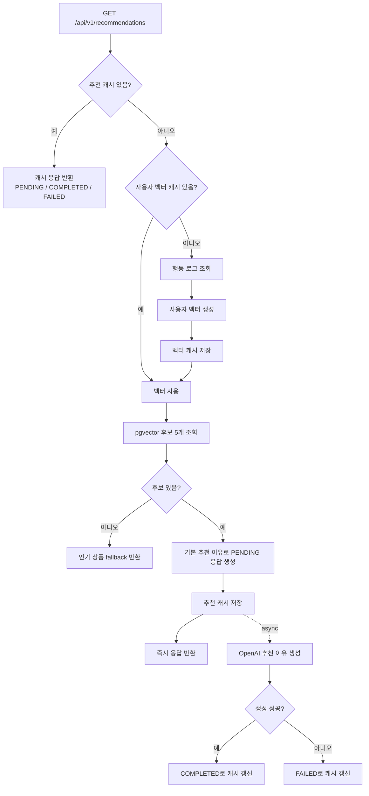
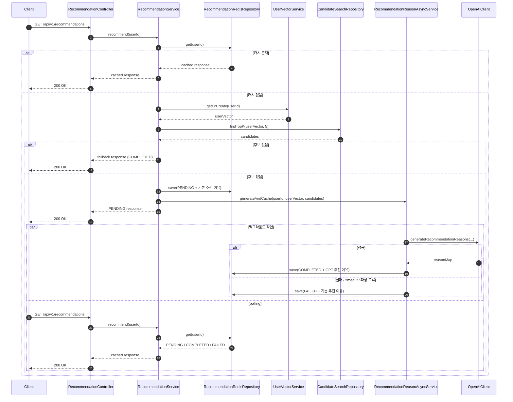
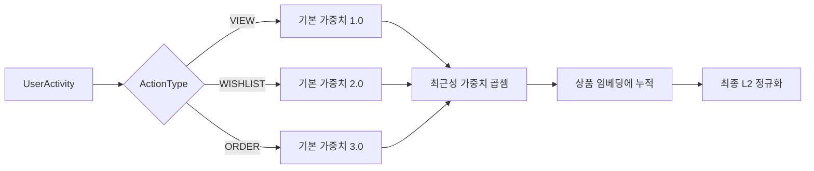
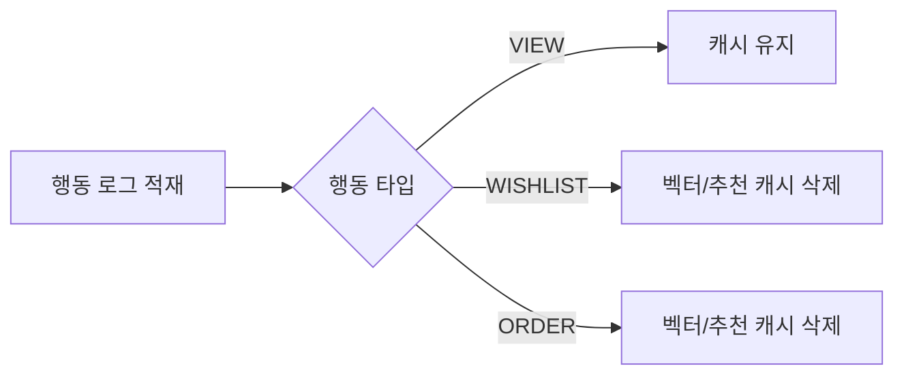

# 추천 로직

## 전체 흐름



## 2-Phase 흐름

### 시퀀스 다이어그램



### 빠른 요약

| Phase | 동작 |
|------|------|
| Phase 1 | 후보를 계산하고 기본 추천 이유로 `PENDING` 응답을 즉시 반환 |
| Phase 2 | OpenAI 추천 이유 생성을 비동기로 수행하고 캐시를 `COMPLETED` 또는 `FAILED`로 갱신 |

## 구현 요약

| 항목 | 현재 구현 |
|------|-----------|
| 추천 개수 | 5개 |
| 추천 캐시 TTL | 20분 |
| 사용자 벡터 TTL | 1시간 |
| 벡터 차원 | 768 |
| 행동 가중치 | `VIEW=1.0`, `WISHLIST=2.0`, `ORDER=3.0` |
| 최근성 기준 | 반감기 14일 |
| VIEW 제한 | 같은 상품 최신 3회까지만 반영 |
| 응답 상태 | `PENDING`, `COMPLETED`, `FAILED` |
| fallback | 인기 상품 추천 |

## 1. 캐시 동작

- 추천 결과 캐시: Redis 20분
- 사용자 벡터 캐시: Redis 1시간
- 추천 캐시가 있으면 그대로 반환합니다.
- 캐시 값은 `PENDING`, `COMPLETED`, `FAILED` 중 하나입니다.
- 추천 캐시가 없으면 사용자 벡터를 조회하고, 그것도 없을 때만 새로 계산합니다.

## 2. 사용자 벡터 생성

사용자 벡터는 `user_activities` 행동 로그와 상품 임베딩을 합쳐 만듭니다.

```text
user_vector = normalize(
  Σ(product_embedding * action_weight * recency_weight)
)
```

### 반영 규칙

- `VIEW = 1.0`
- `WISHLIST = 2.0`
- `ORDER = 3.0`
- 최근 행동일수록 더 크게 반영합니다.
- 반감기는 14일입니다.
- 오래된 `WISHLIST`, `ORDER`도 완전히 제외되지는 않고 점점 약하게 반영됩니다.
- 같은 상품의 `VIEW`는 최신 3회까지만 반영합니다.
- `WISHLIST`, `ORDER`는 이 횟수 제한을 받지 않습니다.
- 상품 임베딩이 없거나 길이가 768이 아니면 그 행동은 건너뜁니다.
- 마지막에 L2 정규화합니다.

### 행동 반영 이미지



## 3. 후보 검색

- 테이블: `product_embeddings`
- 대상 조건: `status = 'ENABLE'`
- 방식: pgvector 코사인 유사도 Top-K 검색
- 개수: 5개

```sql
SELECT id, title, description, price, road_address
FROM product_embeddings
WHERE status = 'ENABLE'
ORDER BY embedding <=> (?::vector)
LIMIT 5
```

## 4. 추천 이유 생성

- 후보가 잡히면 기본 추천 이유로 먼저 응답합니다.
- OpenAI 추천 이유 생성은 `RecommendationReasonAsyncService`에서 비동기로 수행합니다.
- 성공 시 캐시를 `COMPLETED`로 갱신합니다.
- timeout, 5xx, 파싱 실패가 나면 기본 추천 이유를 유지한 채 `FAILED`로 갱신합니다.

## 5. fallback 추천

- 개인화 후보가 없으면 인기 상품 추천으로 대체합니다.
- 조건: `status = 'ENABLE'` 그리고 `popularity > 0`
- 정렬: `popularity DESC`
- fallback 응답 상태는 `COMPLETED`입니다.

## 6. OpenAI 호출 보호

- `RestTemplate`에 connect/read timeout을 설정합니다.
- 추천 이유 생성은 전용 async executor에서 수행합니다.
- 요청 스레드는 OpenAI 응답을 기다리지 않습니다.

## 7. 행동 로그와 캐시 무효화

### 이벤트 -> 행동 타입

- `PRODUCT_VIEWED` -> `VIEW`
- `PRODUCT_WISHLISTED` -> `WISHLIST`
- `ORDER_COMPLETED` -> `ORDER`

### 캐시 정책

- `WISHLIST`, `ORDER`는 사용자 벡터 캐시와 추천 캐시를 즉시 무효화합니다.
- `VIEW`는 발생 빈도가 높아서 즉시 무효화하지 않고 TTL 만료에 맡깁니다.


