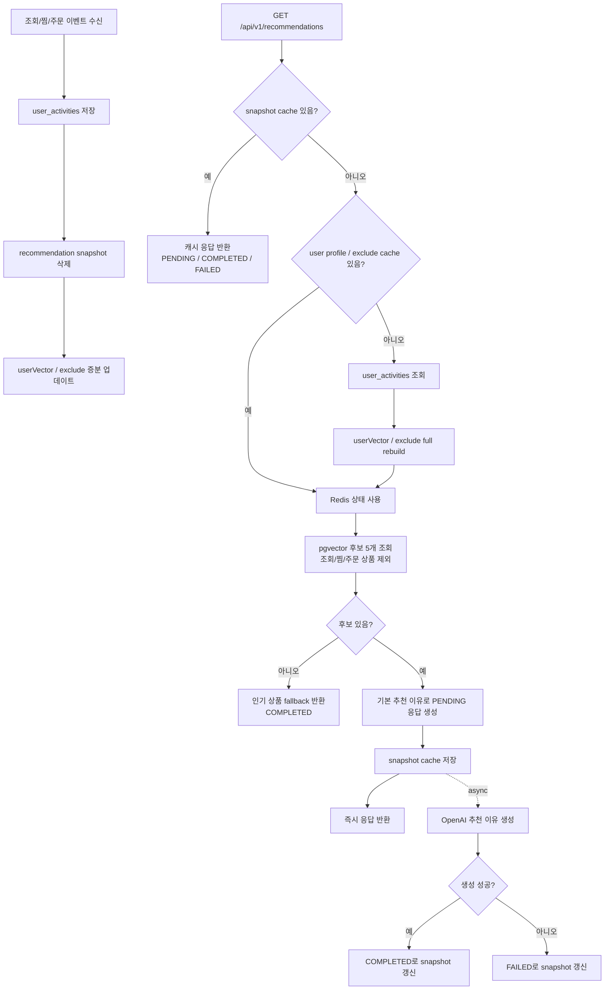
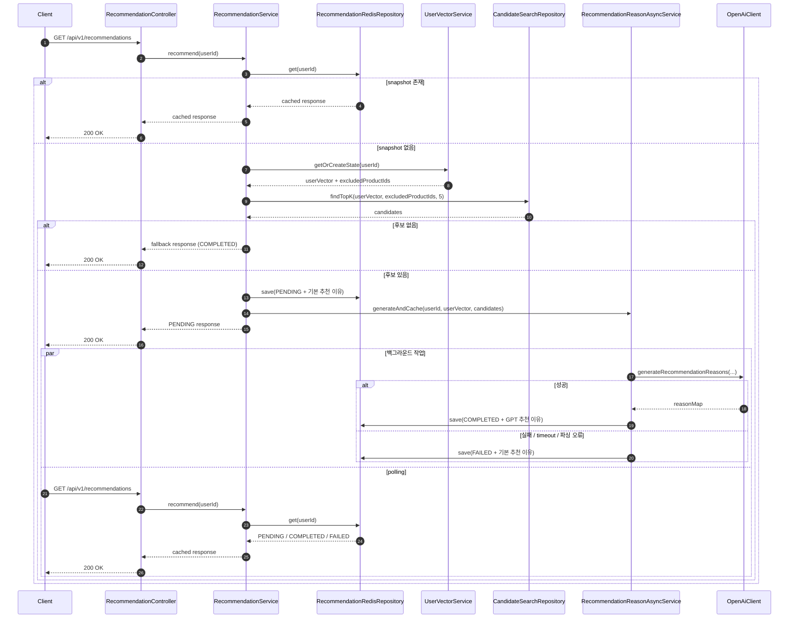

# 추천 로직

## 전체 흐름



## 2-Phase 흐름



## 구현 요약

| 항목 | 현재 구현 |
|------|-----------|
| 추천 개수 | 5개 |
| recommendation snapshot TTL | 20분 |
| user profile / exclude TTL | 6시간 |
| user profile version | 2 |
| 벡터 차원 | 768 |
| 행동 가중치 | `VIEW=1.0`, `WISHLIST=3.0`, `ORDER=5.0` |
| 최근성 기준 | 반감기 14일 |
| VIEW 제외 여부 | 제외함 |
| 응답 상태 | `PENDING`, `COMPLETED`, `FAILED` |
| fallback | 인기 상품 추천 |

## 1. 캐시 동작

- recommendation snapshot 캐시: Redis 20분
- user profile / exclude 캐시: Redis 6시간
- 추천 API는 snapshot 캐시가 있으면 그 값을 그대로 반환합니다.
- snapshot 캐시는 polling 동안 같은 추천 세트를 유지하기 위한 용도입니다.
- snapshot 캐시가 없으면 user profile / exclude 캐시를 조회합니다.
- user profile 또는 exclude 캐시가 없거나 버전이 다르면 `user_activities` 기준으로 full rebuild 합니다.

## 2. 사용자 벡터 생성 및 갱신

사용자 벡터는 아래 두 방식으로 유지됩니다.

1. 이벤트 수신 시 증분 업데이트
2. 캐시 miss 또는 버전 불일치 시 full rebuild

```text
user_vector = normalize(
  decay(previous_user_vector) + (product_embedding * action_weight)
)
```

full rebuild 시에는 전체 행동 로그 기준으로 아래 수식을 사용합니다.

```text
user_vector = normalize(
  Σ(product_embedding * action_weight * recency_weight)
)
```

반영 규칙:

- `VIEW = 1.0`
- `WISHLIST = 3.0`
- `ORDER = 5.0`
- 최근 행동일수록 더 크게 반영합니다.
- 반감기는 14일입니다.
- 상품 임베딩이 없거나 길이가 768이 아니면 그 행동은 건너뜁니다.
- 마지막에 L2 정규화합니다.

## 3. 제외 상품 정책

- `VIEW`, `WISHLIST`, `ORDER` 모두 추천 후보에서 제외합니다.
- 제외 상품 ID는 Redis `user:exclude:v2:{userId}`에 저장합니다.
- full rebuild 시에도 `user_activities` 전체에서 다시 구성합니다.

## 4. 후보 검색

- 테이블: `product_embeddings`
- 대상 조건: `status = 'ENABLE'`
- 방식: pgvector 코사인 유사도 Top-K 검색
- 개수: 5개
- 제외 조건: Redis exclude set에 포함된 상품 ID는 `NOT IN (...)`으로 제거

## 5. 추천 이유 생성

- 후보가 잡히면 기본 추천 이유로 먼저 `PENDING` 응답을 반환합니다.
- OpenAI 추천 이유 생성은 `RecommendationReasonAsyncService`에서 비동기로 수행합니다.
- 성공 시 snapshot을 `COMPLETED`로 갱신합니다.
- timeout, 5xx, 파싱 실패가 나면 기본 추천 이유를 유지한 채 `FAILED`로 갱신합니다.
- 비동기 작업 제출 자체가 거절되면 snapshot을 즉시 `FAILED`로 갱신합니다.

## 6. fallback 추천

- 개인화 후보가 없으면 인기 상품 추천으로 대체합니다.
- 조건: `status = 'ENABLE'` 그리고 `popularity > 0`
- 정렬: `popularity DESC`
- fallback 응답 상태는 `COMPLETED`입니다.

## 7. 행동 로그와 캐시 무효화

이벤트 -> 행동 타입:

- `PRODUCT_VIEWED` -> `VIEW`
- `PRODUCT_WISHLISTED` -> `WISHLIST`
- `ORDER_COMPLETED` -> `ORDER`

캐시 정책:

- 모든 행동 이벤트는 해당 유저의 recommendation snapshot을 즉시 삭제합니다.
- 모든 행동 이벤트는 userVector / exclude를 즉시 증분 업데이트합니다.
- 상품 임베딩이 바뀌면 모든 user profile과 recommendation snapshot을 삭제합니다.
