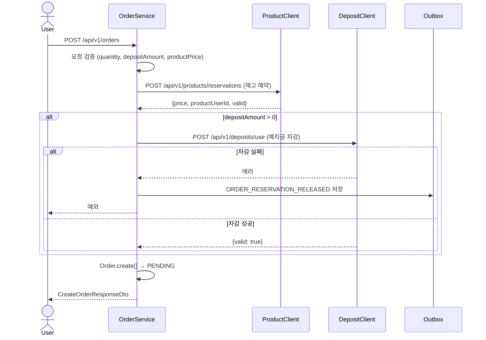
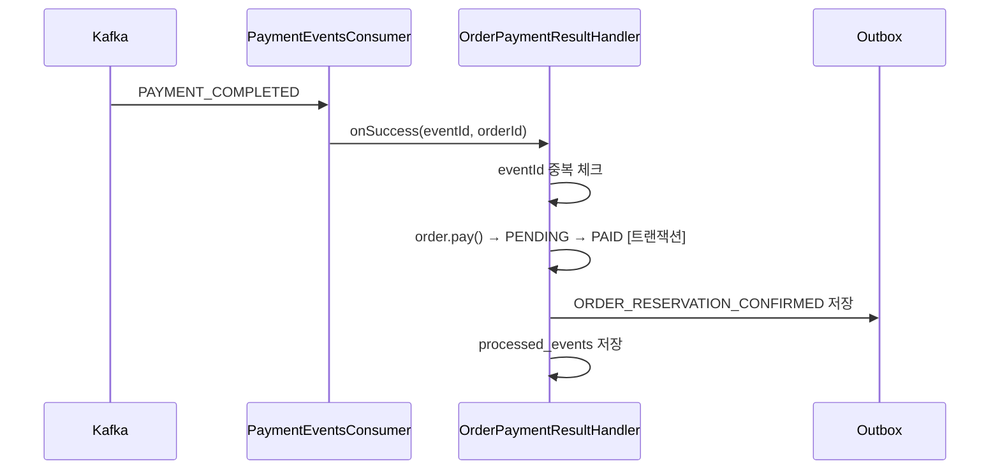
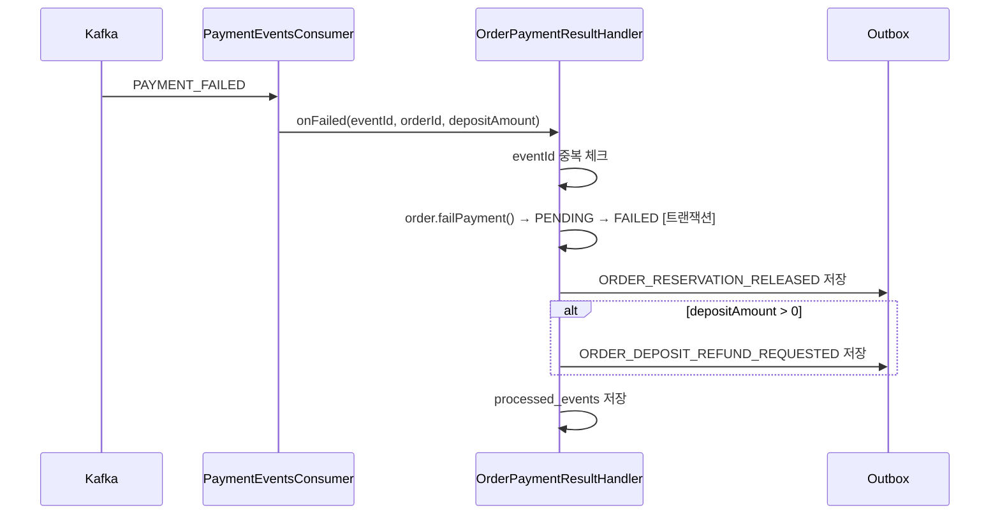
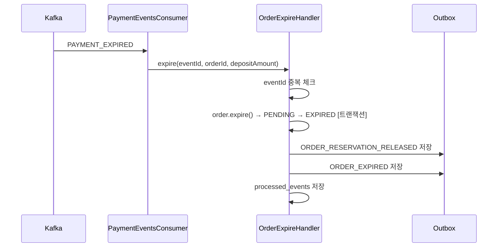

# Order 서비스 구조 및 흐름

## 배경 및 목적

`order` 서비스는 주문 도메인의 중심 서비스로, 주문 생성부터 결제 결과 처리, 만료, 환불까지 주문 생명주기 전체를 담당한다.

| 항목 | 역할 |
|------|------|
| 주문 생성 | Product 재고 예약 + User 예치금 차감 + Order 저장 |
| 결제 결과 처리 | PAYMENT_COMPLETED/FAILED 이벤트 수신 → 상태 변경 + 후속 이벤트 발행 |
| 만료 처리 | PAYMENT_EXPIRED 이벤트 수신 → 상태 변경 + 재고/예치금 복구 이벤트 발행 |
| 환불 처리 | PAYMENT_REFUNDED 이벤트 수신 → REFUNDED 상태 변경 |
| 이벤트 발행 | Outbox 패턴으로 order.events 토픽에 발행 |
| 정산 연동 | 주문 다건 조회 내부 API 제공 |

---

## 도메인 상태값

### Order — `OrderStatus`

| 상태 | 진입 조건 |
|------|-----------|
| `PENDING` | 주문 생성 직후 |
| `PAID` | `PAYMENT_COMPLETED` Kafka 이벤트 수신 |
| `FAILED` | `PAYMENT_FAILED` Kafka 이벤트 수신 |
| `EXPIRED` | `PAYMENT_EXPIRED` Kafka 이벤트 수신 |
| `REFUNDED` | `PAYMENT_REFUNDED` Kafka 이벤트 수신 |

---

## 패키지 구조 및 계층 역할

```
presentation/controller/
  OrderController.java            — 주문 생성/조회/취소
  OrderInternalController.java    — 금액 검증, 상태 업데이트, 정산용 다건 조회

application/service/
  OrderService.java               — 주문 생성 오케스트레이션, 조회, 상태 변경 위임
  handler/
    OrderPaymentResultHandler.java — 결제 성공/실패 후 @Transactional 처리
    OrderExpireHandler.java        — 만료 후 @Transactional 처리

application/port/external/
  ProductPort.java                — Product 서비스 연동 인터페이스
  DepositPort.java                — User 서비스 예치금 연동 인터페이스

domain/model/
  Order.java                      — 주문 엔티티 (상태 전이 메서드 포함)
  OrderStatus.java                — 주문 상태 enum

infrastructure/client/
  product/ProductClient.java      — ProductPort 구현 (재고 예약 HTTP)
  deposit/DepositClient.java      — DepositPort 구현 (예치금 차감 HTTP)

infrastructure/kafka/
  payment/PaymentEventsConsumer.java — payment.events 수신
  product/dto/                    — order → product 이벤트 DTO
  user/dto/                       — order → user 이벤트 DTO

infrastructure/outbox/
  OutboxEvent.java                — Outbox 이벤트 엔티티
  OutboxPublisher.java            — 1초 주기 스케줄러, Kafka 발행
```

---

## 핵심 서비스별 책임

### OrderService

| 기능 | 설명 |
|------|------|
| 주문 생성 (`create`) | 재고 예약 → 예치금 차감 → Order 저장 (tx 없음, 외부 호출 포함) |
| 주문 조회 | 단건/목록/정산용 다건 조회 |
| 환불 정보 조회 (`getRefundInfo`) | Payment 서비스 환불 상세 + 수업 시작일 조합하여 응답 |
| 금액 검증 | Payment 서비스가 confirm 전 호출하는 내부 API |
| 상태 변경 위임 | `updatePaymentStatus` → 핸들러 위임 |

### OrderPaymentResultHandler

결제 결과 이벤트 수신 시 독립된 트랜잭션으로 처리한다.

| 메서드 | 처리 내용 |
|--------|-----------|
| `onSuccess` | eventId 중복 체크 → order.pay() → ORDER_RESERVATION_CONFIRMED Outbox 저장 |
| `onFailed` | eventId 중복 체크 → order.failPayment() → ORDER_RESERVATION_RELEASED Outbox 저장 + (depositAmount > 0) ORDER_DEPOSIT_REFUND_REQUESTED Outbox 저장 |

### OrderExpireHandler

만료 이벤트 수신 시 독립된 트랜잭션으로 처리한다.

| 메서드 | 처리 내용 |
|--------|-----------|
| `expire` | eventId 중복 체크 → order.expire() → ORDER_RESERVATION_RELEASED + ORDER_EXPIRED Outbox 저장 |

---

## 주요 요청 흐름

### 주문 생성



### 결제 성공 처리



### 결제 실패 처리



### 만료 처리



> 각 시나리오 전체 흐름(Product/User 후처리 포함)은 `docs/order/payment-flows/` 참고.

---

## 외부 서비스 연동

### Product 서비스 — `ProductClient` (`ProductPort` 구현)

| 메서드 | 엔드포인트 | 용도 |
|--------|-----------|------|
| `reserve` | `POST /api/v1/products/reservations` | 재고 차감 + 가격 검증 + ProductUser 생성 |

### User 서비스 — `DepositClient` (`DepositPort` 구현)

| 메서드 | 엔드포인트 | 용도 |
|--------|-----------|------|
| `validateAndUse` | `POST /api/v1/deposits/use` | 예치금 잔액 확인 + 차감 |

### Payment 서비스 — `PaymentAdapter` (`PaymentPort` 구현)

| 메서드 | 엔드포인트 | 용도 |
|--------|-----------|------|
| `refund` | `POST /api/v1/payments/internal/refunds` | 환불 요청 (PG + 예치금 환불금액 반환) |
| `getRefundInfo` | `GET /api/v1/payments/internal/refunds/orders/{orderId}` | 환불 상세 정보 조회 |

---

## Outbox 패턴

주문 이벤트는 Kafka에 직접 발행하지 않고 `order_outbox_events` 테이블에 먼저 저장한다.

```
[트랜잭션] 상태 변경 + OutboxEvent 저장 → 원자적 커밋
[OutboxPublisher 스케줄러 — 1초 주기]
  → PENDING/SENDING 이벤트 조회 (FOR UPDATE SKIP LOCKED)
  → PENDING → SENDING 상태 전이
  → Kafka 발행 (kafkaTemplate.send().get())
  → 성공: SENDING → PUBLISHED
  → 실패: retry_count++ / 임계값 초과 시 FAILED
```

### 발행 이벤트 목록

| EventType | 발행 시점 | 토픽 |
|-----------|-----------|------|
| `ORDER_RESERVATION_CONFIRMED` | 결제 성공 후 재고 확정 | `order.events` |
| `ORDER_RESERVATION_RELEASED` | 결제 실패/만료 후 재고 복구 | `order.events` |
| `ORDER_DEPOSIT_REFUND_REQUESTED` | 결제 실패 + 예치금 사용 시 환불 요청 | `order.events` |
| `ORDER_EXPIRED` | 만료 시 예치금 복구 요청 | `order.events` |

> 이벤트 페이로드 상세는 `docs/kafka-topics.md` 참고.

---

## 멱등성 처리

Kafka at-least-once 특성으로 동일 이벤트가 중복 수신될 수 있다.  
`order_processed_events` 테이블에 `eventId`(PK)를 저장하여 중복 처리를 방어한다.

```java
// 같은 @Transactional 안에서
if (eventId != null && processedEventRepository.existsById(eventId)) return;
order.pay();
outboxRepository.save(...);
processedEventRepository.save(ProcessedEvent.of(eventId));
```

- `existsById` 체크 + 비즈니스 로직 + `processed_events` 저장이 하나의 트랜잭션
- 동시 진입 시 PK 유니크 제약으로 하나만 커밋, 나머지는 예외 → 재시도 → existsById=true → return
