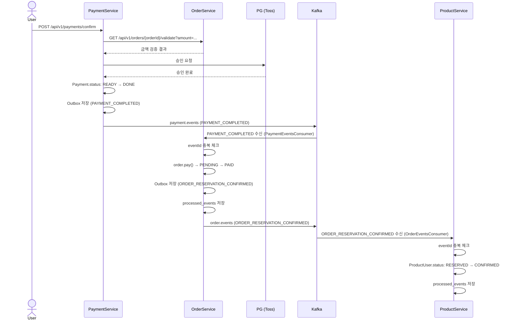

# 결제 성공

## 흐름

```
User → PaymentService: POST /api/v1/payments/confirm
  │
  PaymentService
  ├─ HTTP → OrderService: 금액 검증
  ├─ PG 승인 요청
  ├─ Payment.status: READY → DONE
  └─ Outbox 저장 (PAYMENT_COMPLETED)
       └─ OutboxPublisher → Kafka: payment.events (PAYMENT_COMPLETED)
            └─ OrderService (PaymentEventsConsumer)
                 eventId 중복 체크 → order.pay() → PENDING → PAID
                 Outbox 저장 (ORDER_RESERVATION_CONFIRMED) + processed_events 저장
                 └─ OutboxPublisher → Kafka: order.events (ORDER_RESERVATION_CONFIRMED)
                      └─ ProductService (OrderEventsConsumer)
                           eventId 중복 체크 → ProductUser.status: RESERVED → CONFIRMED
                           processed_events 저장
```



---

## 각 모듈 처리

### Payment — `PaymentService.confirm()`

1. Payment 조회 (orderId 기준)
2. 멱등성 처리: 이미 `DONE`이면 그대로 반환
3. OrderService HTTP 호출 — 금액 검증 (`GET /api/v1/orders/{orderId}/validate?amount=...`)
4. 내부 금액 검증: `paymentAmount == request.amount`
5. PG 승인 요청 (`paymentGatewayPort.confirm`)
6. `PaymentConfirmHandler.onSuccess()` — 하나의 트랜잭션
   - `Payment.status → DONE`, `paymentKey` 저장
   - Outbox 저장 (`PAYMENT_COMPLETED`)

Kafka 이벤트:
```
Topic:  payment.events
Header: eventType = PAYMENT_COMPLETED
Body:   { "eventId": "UUID", "orderId": "UUID" }
```

### Order — `PaymentEventsConsumer` → `OrderPaymentResultHandler.onSuccess()`

1. `PAYMENT_COMPLETED` 수신
2. `eventId` 기준 `processed_events` 조회 → 이미 존재하면 즉시 return (중복 방지)
3. `order.getStatus() == PAID`이면 return (상태 가드)
4. 하나의 트랜잭션으로 처리:
   - `order.pay()` → `PENDING → PAID`
   - Outbox 저장 (`ORDER_RESERVATION_CONFIRMED`)
   - `processed_events` 저장

Kafka 이벤트:
```
Topic:  order.events
Header: eventType = ORDER_RESERVATION_CONFIRMED
Body:   { "eventId": "UUID", "orderId": "UUID", "productUserId": "UUID" }
```

### Product — `OrderEventsConsumer` → `OrderEventHandler.handleReservationConfirmed()`

1. `ORDER_RESERVATION_CONFIRMED` 수신
2. `eventId` 기준 `processed_events` 조회 → 이미 존재하면 즉시 return
3. 하나의 트랜잭션으로 처리:
   - `scheduleUseCase.reservationCompleted()` → `ProductUser.status: RESERVED → CONFIRMED`
   - `processed_events` 저장

---

## 결과 상태

| 도메인 | 상태 |
|--------|------|
| `Payment.status` | `DONE` |
| `Order.status` | `PAID` |
| `ProductUser.status` | `CONFIRMED` |
| Schedule 잔여 인원 | 차감 유지 |
