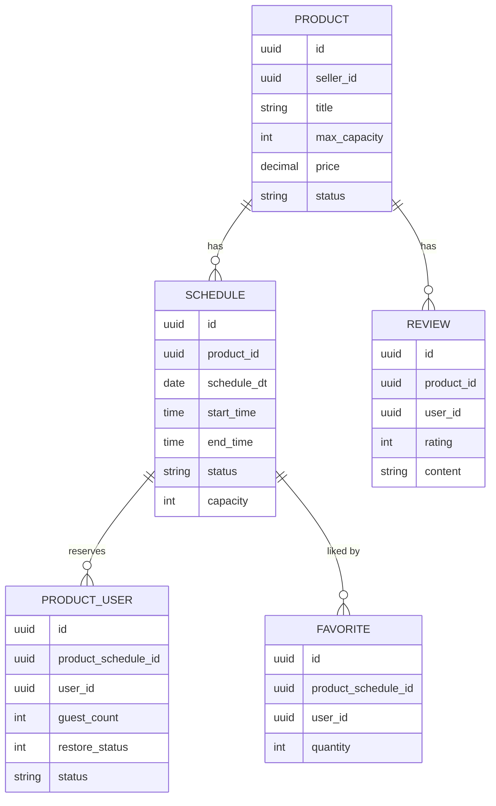

# Product Schema

## 배경 및 목적

`product` 모듈의 엔티티들은 JPA 객체 그래프보다 `UUID` 기반 참조를 중심으로 연결됩니다.  
즉 코드상으로는 느슨하게 연결되어 있지만, 도메인 관점에서는 명확한 상하 관계와 흐름이 존재합니다.

이 문서는 `domain.model` 하위 엔티티를 기준으로 아래를 정리합니다.

| 항목 | 설명 |
|------|------|
| 엔티티별 역할 | 각 모델이 어떤 책임을 가지는지 |
| 논리 연관관계 | 어떤 엔티티가 어떤 엔티티를 참조하는지 |
| 생성/변경 흐름 | 어떤 유스케이스에서 데이터가 만들어지고 바뀌는지 |
| 운영 포인트 | 상태값, soft delete, 재고 컬럼 등 주의할 점 |

---

## 현재 모델 구조

### 엔티티 목록

| 엔티티 | 테이블 | 설명 |
|------|------|------|
| `Product` | `products` | 상품 마스터 |
| `Schedule` | `products_schedule` | 상품별 일정/회차 |
| `ProductUser` | `products_users` | 일정 예약 사용자 |
| `Review` | `product_reviews` | 상품 리뷰 |
| `Favorite` | `products_likes` | 일정 찜 |
| `EntityBase` | 공통 상속 | 감사 컬럼 및 soft delete 공통 필드 |

### 공통 상속 구조

```text
EntityBase
  ├─ Product
  ├─ Schedule
  ├─ ProductUser
  ├─ Review
  └─ Favorite
```

`EntityBase`는 모든 엔티티가 공통으로 사용하는 필드를 제공합니다.

| 필드 | 설명 |
|------|------|
| `id` | UUID PK |
| `regDt` | 생성 시각 |
| `modifyDt` | 수정 시각 |
| `deleteDt` | soft delete 시각 |

> `deleteDt`가 null이 아니면 논리 삭제 데이터로 간주합니다.

---

## 엔티티별 상세

### 1. Product

상품은 루트 엔티티입니다.  
일정, 리뷰, 검색 문서의 출발점이 되는 가장 상위 개념입니다.

| 필드 | 설명 |
|------|------|
| `sellerId` | 판매자 user id |
| `title` | 상품명 |
| `maxCapacity` | 각 일정의 최대 허용 인원 기준값 |
| `description` | 상품 설명 |
| `thumbnailPath` | 대표 이미지 경로 |
| `descriptionImages` | 상세 이미지 목록 |
| `price` | 가격 |
| `status` | 상품 상태 (`ENABLE`, `DISABLE`) |

#### 논리 관계
- `Product 1 : N Schedule`
- `Product 1 : N Review`
- `Product 1 : 1 ProductDocument(ES)`
- `Product N : 1 User(외부 user 서비스의 seller)`

#### 관계 해석
- 하나의 상품은 여러 일정(`Schedule`)을 가집니다.
- 리뷰는 상품 단위로 누적됩니다.
- 검색용 문서(`ProductDocument`)는 `Product`를 기준으로 파생 생성됩니다.
- `sellerId`는 product DB 내부 엔티티가 아니라 API Gateway와 user 서비스를 통해 식별하는 외부 사용자 ID입니다.

---

### 2. Schedule

상품의 특정 날짜/시간 회차입니다.  
실제 예약 가능 재고를 가지며 주문 전 검증, 결제 후 재고 복구, 만료 일정 자동 마감의 기준 엔티티입니다.

| 필드 | 설명 |
|------|------|
| `productId` | 상위 상품 id |
| `scheduleDt` | 일정 날짜 |
| `startTime` | 시작 시간 |
| `endTime` | 종료 시간 |
| `status` | 일정 상태 (`FULL`, `AVAILABLE`, `CLOSED`) |
| `capacity` | 현재 남은 예약 가능 인원 |

#### 논리 관계
- `Schedule N : 1 Product`
- `Schedule 1 : N ProductUser`
- `Schedule 1 : N Favorite`

#### 관계 해석
- `productId`로 상위 `Product`를 참조합니다.
- 하나의 일정에는 여러 예약 사용자(`ProductUser`)가 붙습니다.
- 하나의 일정은 여러 사용자에게 찜(`Favorite`)될 수 있습니다.
- 예약 상세 조회 시에는 `ProductUser.productScheduleId`를 통해 역으로 일정 단건을 조회합니다.

#### 도메인 규칙
- `capacity`는 생성 시 `Product.maxCapacity` 값으로 초기화됩니다.
- 주문 검증 시 `capacity`가 감소합니다.
- 취소/환불 시 `capacity`가 다시 복구됩니다.
- 만료 일정 스케줄러는 오늘 이전 일정 중 `AVAILABLE` 상태인 일정을 배치로 `CLOSED` 처리합니다.
- `ReservedStatus`에서 대기(`PENDING`) 상태는 제거되었으므로 현재 일정 상태는 `FULL`, `AVAILABLE`, `CLOSED`만 사용합니다.
- `capacity`는 null이면 안 되며, 실질적인 재고 컬럼입니다.

---

### 3. ProductUser

상품 일정에 대한 예약 사용자 엔티티입니다.  
주문 생성 직전 선점 정보이자, 결제 후 상태 추적의 중심 엔티티입니다.

| 필드 | 설명 |
|------|------|
| `productScheduleId` | 예약 대상 일정 id |
| `userId` | 예약 사용자 id |
| `guestCount` | 예약 인원 |
| `restoreStatus` | 재고 복구 중복 방지 플래그 |
| `status` | 예약 상태 (`RESERVED`, `CONFIRMED`, `RELEASED`, `REFUNDED`) |

#### 논리 관계
- `ProductUser N : 1 Schedule`
- `ProductUser N : 1 User(외부 user 서비스)`

#### 관계 해석
- `productScheduleId`를 통해 어떤 일정에 대한 예약인지 결정합니다.
- `userId`는 product DB 내부 사용자 엔티티가 아니라 외부 user 서비스의 사용자 ID를 참조합니다.

#### 상태 흐름

```text
RESERVED   -> 결제 전 임시 선점
CONFIRMED  -> 결제 완료 후 예약 확정
RELEASED   -> 결제 취소/실패로 해제
REFUNDED   -> 환불 완료
```

#### 복구 흐름과 정합성 규칙
- 복구 가능 여부는 `claimRestore()`에서 현재 상태와 `restoreStatus`를 함께 검증합니다.
- `restoreStatus = 1`은 복구 처리 중 또는 이미 복구 처리된 상태를 의미합니다.
- `restoreCapacity()` 또는 `updateStatus()`가 실패하면 예외를 던져 트랜잭션 전체를 롤백합니다.
- 따라서 `restoreStatus`만 풀리고 재고가 중복 복구되는 상황을 방지하는 방향으로 동작합니다.

---

### 4. Review

상품 리뷰 엔티티입니다.

| 필드 | 설명 |
|------|------|
| `productId` | 리뷰 대상 상품 id |
| `userId` | 작성자 user id |
| `rating` | 평점 |
| `content` | 리뷰 내용 |

#### 논리 관계
- `Review N : 1 Product`
- `Review N : 1 User(외부 user 서비스)`

#### 관계 해석
- 리뷰는 상품 단위로 묶입니다.
- 작성자 정보는 `userId`만 저장하고 필요 시 외부 서비스와 조합합니다.

#### 특징
- 삭제는 hard delete가 아니라 `deleteDt` 기반 soft delete로 처리합니다.

---

### 5. Favorite

상품 찜 엔티티입니다.

| 필드 | 설명 |
|------|------|
| `productScheduleId` | 찜 대상 일정 id |
| `userId` | 찜한 사용자 id |
| `quantity` | 관심 인원 또는 화면 표시용 수량 값 |

#### 논리 관계
- `Favorite N : 1 Schedule`
- `Favorite N : 1 User(외부 user 서비스)`

#### 관계 해석
- 찜은 상품 자체가 아니라 일정(`Schedule`) 기준으로 저장됩니다.
- 사용자 정보는 직접 객체 참조를 갖지 않고 `userId`만 유지합니다.

---

## 엔티티 간 전체 관계


> 실제 코드에는 JPA `@ManyToOne` 관계가 거의 없지만, 도메인상으로는 위 구조로 이해하는 것이 맞습니다.

---

## 주요 흐름 기준 관계 해석

### 1. 상품 생성

```text
Product 생성
  -> file 서비스로 이미지 확인
  -> Product 저장
  -> user 서비스로 seller 정보 조회
  -> ES 문서 생성
```

이 단계에서는 `Product`만 직접 생성하고, `Schedule`은 아직 없습니다.

### 2. 일정 생성

```text
Product 조회
  -> Schedule 생성
  -> Schedule.capacity = Product.maxCapacity
```

즉 `Schedule.capacity`는 입력값이 아니라 최초에는 `Product.maxCapacity`를 복사해 시작하는 값입니다.

### 3. 일정 단건 조회

```text
ProductUser 조회
  -> ProductUser.productScheduleId 확인
  -> Schedule 조회
```

이 흐름은 예약과 일정이 `productScheduleId`를 통해 연결된다는 점을 보여줍니다.

### 4. 주문 검증

```text
Schedule 조회
  -> capacity 차감
  -> ProductUser 생성
```

여기서 `ProductUser`는 결제 완료 후 구매자라기보다 예약 선점 사용자 개념에 가깝습니다.

### 5. 결제 완료

```text
ProductUser.status
  RESERVED -> CONFIRMED
```

### 6. 결제 취소/환불

```text
claimRestore 선점
  -> Schedule.capacity 복구
  -> ProductUser.status 변경
  -> 실패 시 전체 롤백
```

### 7. 만료 일정 자동 마감

```text
ScheduleStatusScheduler
  -> closeExpiredSchedulesOnce()
  -> findClosableIds()
  -> bulkClose(AVAILABLE -> CLOSED)
```

이 흐름 때문에 `Schedule`은 단순 일정 엔티티가 아니라 재고와 상태 전이의 중심 엔티티입니다.

---

## 외부 서비스와의 연결

product 스키마는 내부 엔티티만으로 완결되지 않습니다.  
특히 `user`, `file`, `api-gateway`와의 연결을 함께 이해해야 합니다.

| 외부 구성요소 | 연결 필드 | 설명 |
|------------|-----------|------|
| `api-gateway` | `X-User-Id`, `X-User-Role` | 요청 사용자 식별값 전달 |
| `user` | `sellerId`, `userId` | 판매자, 예약자, 리뷰 작성자, 찜 사용자 참조 |
| `file` | `thumbnailPath`, `descriptionImages.fileId/storagePath` | 상품 이미지 메타데이터 연결 |

### 중요 포인트
- `sellerId`, `userId`는 모두 외부 user 서비스의 ID입니다.
- product 서비스는 API Gateway가 전달한 사용자 헤더를 신뢰해 컨트롤러에서 사용자 식별값을 꺼냅니다.
- product DB 내부에는 사용자 엔티티가 없습니다.
- 따라서 관계는 DB FK보다 서비스 간 참조로 이해해야 합니다.

---

## 운영 시 주의사항

### 1. 물리 FK보다 논리 관계가 중요합니다

현재 모델은 UUID 참조 중심이라 JPA에서 객체 탐색이 자동으로 되지 않습니다.  
대신 서비스 로직에서 관계를 명시적으로 따라가야 합니다.

### 2. 상태값과 DB 제약조건을 함께 관리해야 합니다

특히 `products_users.status`는 자바 enum과 DB 제약조건이 항상 일치해야 합니다.

- Java enum: `ReservationStatus`
- DB check constraint: `products_users_status_check`

이 둘이 어긋나면 insert/update가 모두 실패합니다.

### 3. `Schedule.capacity`는 단순 컬럼이 아니라 재고입니다
- null이면 안 됩니다.
- 주문/결제 흐름에서 직접 차감/복구됩니다.
- 마이그레이션 시 가장 먼저 정합성을 확인해야 하는 컬럼입니다.

### 4. `Schedule.status`는 현재 3개 값만 사용합니다
- `AVAILABLE`
- `FULL`
- `CLOSED`

기존 `PENDING` 상태는 제거되었고, 만료 일정 배치도 이 기준으로 동작합니다.

### 5. soft delete를 전제로 조회해야 합니다

`Product`, `Schedule`, `Review`, `Favorite`는 `deleteDt` 기반 soft delete를 사용합니다.  
따라서 조회 로직에서 `deleteDt is null` 조건이 빠지면 논리 삭제 데이터가 다시 보일 수 있습니다.

### 6. Gateway 헤더 신뢰 전제가 깨지면 컨트롤러 사용자 식별이 실패합니다

현재 product 서비스는 자체 인증 필터보다 `CurrentUserArgumentResolver`와 `CurrentUserRoleArgumentResolver`에 의존합니다.  
따라서 API Gateway가 `X-User-Id`, `X-User-Role`을 정확히 전달한다는 전제가 중요합니다.

---

## 체크리스트

### 엔티티 구조
- [x] `EntityBase` 공통 상속 구조 정리
- [x] `Product -> Schedule` 관계 정리
- [x] `Schedule -> ProductUser` 관계 정리
- [x] `Product -> Review` 관계 정리
- [x] `Schedule -> Favorite` 관계 정리
- [x] `ProductUser -> Schedule` 역추적 조회 흐름 정리
- [x] 만료 일정 자동 마감 배치 반영

### 운영 정합성
- [ ] `products_users.status_check`를 `ReservationStatus` 기준으로 수정
- [ ] `products_schedule.capacity` null 데이터 제거
- [ ] `products_users.reg_dt` not null 정리
- [ ] 스키마 문서와 실제 DB 상태 일치 여부 재검증