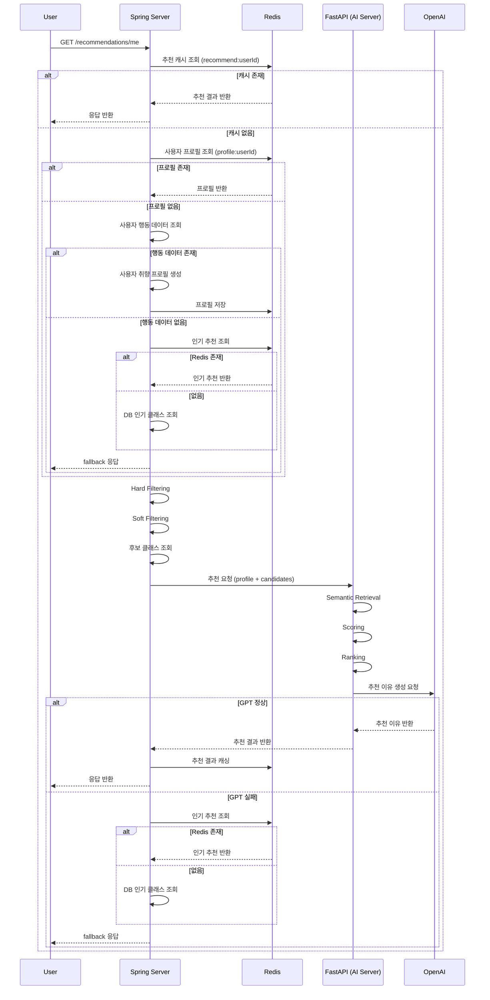

# AI 추천 기능

## 1. 개요

이 기능은 사용자 행동 데이터를 바탕으로 개인화 추천을 수행하고, 생성형 AI를 사용해 추천 이유를 자연어로 설명하는 구조이다.

핵심 목표는 다음과 같다.

* 사용자 맞춤 클래스 추천
* 빠른 응답을 위한 캐시 활용
* AI 장애 시 인기 추천으로 fallback 제공

---

## 2. 사용할 기술

### OpenAI API

* 사용자 프로필 텍스트화 또는 요약 (선택)
* 임베딩 생성
* 추천 이유 생성

### Retrieval-Augmentation-Generation 구조

* **Retrieval**: 사용자 취향 프로필 기반으로 후보 클래스 검색
* **Augmentation**: 사용자 취향 + 후보 클래스 정보를 GPT 입력으로 구성
* **Generation**: 추천 이유 생성

> 참고: 여기서의 RAG는 전통적인 문서 기반 RAG라기보다, 추천 후보 검색과 생성형 설명 구조를 응용한 형태이다.

### Redis

* **추천 결과 캐시**

    * 같은 사용자가 홈 화면을 반복 조회할 때 매번 추천 계산과 GPT 호출을 반복하지 않기 위함
* **사용자 취향 프로필 캐시**

    * 추천 요청마다 조회/장바구니/주문 데이터를 다시 집계하지 않기 위함
* **실시간 행동 집계 캐시**

    * Redis hash / sorted set 등을 활용해 임시 집계
* **인기 추천 캐시**

    * 개인화 추천 불가 또는 AI 실패 시 fallback 제공

---

## 3. 프로젝트 구조

### 전체 구조

```text
beadv5_5_ChamomileChicken_BE
 ├─ service
 │   ├─ order
 │   ├─ product
 │   ├─ user
 │   ├─ recommendation
 │   └─ ai (optional)
 │
 ├─ ai-server        ← FastAPI
 │   ├─ app
 │   │   ├─ api
 │   │   ├─ services
 │   │   ├─ schemas
 │   │   └─ main.py
 │   ├─ requirements.txt
 │   └─ .env
 └─ README.md
```

### 상세 구조

```text
beadv5_5_ChamomileChicken_BE
 ├─ service
 │   ├─ order
 │   ├─ product
 │   ├─ user
 │   │
 │   ├─ recommendation
 │   │   ├─ presentation
 │   │   │   └─ RecommendationController.java
 │   │   │
 │   │   ├─ application
 │   │   │   └─ RecommendationFacade.java
 │   │   │
 │   │   ├─ domain
 │   │   │   ├─ model
 │   │   │   │   ├─ UserProfile.java
 │   │   │   │   ├─ RecommendationResult.java
 │   │   │   │   └─ CandidateClass.java
 │   │   │   │
 │   │   │   └─ service
 │   │   │       └─ RecommendationScoringService.java
 │   │   │
 │   │   ├─ infrastructure
 │   │   │   ├─ ai
 │   │   │   │   ├─ AiRecommendationPort.java
 │   │   │   │   └─ AiRecommendationClient.java
 │   │   │   │
 │   │   │   ├─ cache
 │   │   │   │   └─ RedisRecommendationCacheRepository.java
 │   │   │   │
 │   │   │   ├─ reader
 │   │   │   │   ├─ UserBehaviorReader.java
 │   │   │   │   └─ CandidateClassReader.java
 │   │   │   │
 │   │   │   └─ fallback
 │   │   │       └─ PopularRecommendationProvider.java
 │   │   │
 │   │   └─ dto
 │   │       ├─ response
 │   │       │   └─ RecommendationResponseDto.java
 │   │       └─ request
 │   │           └─ (optional)
 │   │
 │   └─ ai (optional)
 │       ├─ openai
 │       │   └─ OpenAiClient.java
 │       ├─ prompt
 │       │   └─ PromptBuilder.java
 │       └─ config
 │           └─ OpenAiConfig.java
 │
 ├─ ai-server
 │   ├─ app
 │   │   ├─ main.py
 │   │   ├─ api
 │   │   │   └─ recommendation.py
 │   │   ├─ schemas
 │   │   │   ├─ request.py
 │   │   │   └─ response.py
 │   │   ├─ services
 │   │   │   ├─ recommender.py
 │   │   │   ├─ ranking.py
 │   │   │   ├─ prompt_builder.py
 │   │   │   └─ openai_client.py
 │   │   ├─ core
 │   │   │   └─ config.py
 │   │   └─ utils
 │   │       └─ logger.py
 │   ├─ requirements.txt
 │   ├─ .env
 │   └─ README.md
 │
 ├─ docker-compose.yml (optional)
 └─ README.md
```

---

## 4. 추천 흐름

### 정상 흐름

1. 사용자 요청
2. Redis 추천 결과 캐시 조회

    * 있으면: 바로 반환
    * 없으면: 다음 단계
3. Redis 사용자 취향 프로필 캐시 조회

    * 있으면: 그대로 사용
    * 없으면: 다음 단계
4. 사용자 행동 데이터 수집

    * 있으면: 사용자 취향 프로필 생성 후 Redis 저장
    * 없으면: fallback(인기 추천)으로 이동

### 사용자 취향 프로필

* 조회, 장바구니, 주문 기반으로 태그 점수 생성
* Retrieval과 Scoring에서 공통 사용

5. 후보 클래스 검색

    1. **Hard Filtering**

        * 이미 구매한 클래스 제외
        * 마감/품절 제외
    2. **Soft Filtering**

        * 지역 일치
        * 가격대 유사
    3. **Semantic Retrieval**

        * 클래스(제목, 설명, 태그) 임베딩
        * 사용자 취향 프로필 임베딩
        * cosine similarity 계산
        * 상위 100개 후보 선택
6. Scoring

    * semantic_similarity: retrieval 결과 재사용
    * behavior_match: 조회/장바구니/주문 기반
    * price_fit: 가격 적합도
    * region_fit: 지역 적합도
    * popularity_score: 약한 보정값
7. Ranking

    * final_score 기준 정렬
    * 상위 10개 선택
8. GPT 입력 구성 (Augmentation)
9. 추천 이유 생성 (Generation)
10. Redis 추천 결과 캐싱
11. 응답 반환

### 점수 계산 구조

#### 1) 취향 적합도 (Preference)

```text
preference = semantic_similarity * 0.7 + behavior_match * 0.3
```

#### 2) 선택 가능성 (Feasibility)

```text
feasibility = price_fit * 0.5 + region_fit * 0.5
```

#### 3) 최종 점수 (Final Score)

```text
final_score =
    preference * 0.6 +
    feasibility * 0.3 +
    popularity * 0.1
```

> 의미: 좋아할 가능성 + 현실성 + 안정성

---

## 5. 실패 시 fallback 흐름

### 조건

* 사용자 행동 데이터 없음
* GPT 실패 또는 AI 서버 오류

### fallback 순서

1. Redis 인기 추천 조회

    * 있으면: 반환
    * 없으면: 다음 단계
2. DB 인기 클래스 조회
3. 반환

---

## 6. 시퀀스 다이어그램



---

## 7. API 명세

### GET /api/v1/recommendations/me

#### Response Fields

| 필드                        | 타입      | 설명             |
| ------------------------- | ------- | -------------- |
| userId                    | UUID    | 요청 사용자 ID      |
| recommendations           | List    | 추천 클래스 목록      |
| recommendations[].classId | Long    | 클래스 ID         |
| recommendations[].title   | String  | 클래스 이름         |
| recommendations[].score   | Double  | 최종 적합도 점수      |
| recommendations[].reason  | String  | 추천 이유 (GPT 생성) |
| cached                    | Boolean | 추천 결과 캐시 사용 여부 |

#### Example

```json
{
  "userId": "9c52c3c0-08d9-4f3d-a763-31d7b3d3f1e1",
  "recommendations": [
    {
      "classId": 101,
      "title": "성수 도예 원데이 클래스",
      "score": 0.92,
      "reason": "최근 도예 클래스를 자주 조회하셨고, 성수 지역 선호와도 잘 맞아 추천드립니다."
    },
    {
      "classId": 203,
      "title": "홍대 베이킹 입문 클래스",
      "score": 0.84,
      "reason": "장바구니에 담은 클래스와 유사한 입문형 체험으로 추천드립니다."
    }
  ],
  "cached": true
}
```

---

## 8. FastAPI를 사용하는 이유

Spring 내부에서도 추천 로직을 구현할 수 있지만, 다음 이유로 추천 로직을 FastAPI 서버로 분리하는 것이 유리하다.

* 추천 기준과 가중치를 코드로 명확하게 관리하기 쉬움
* Python 기반 임베딩/벡터/실험 생태계를 활용하기 쉬움
* 추천 로직과 일반 서비스 로직을 분리해 독립적으로 운영하기 쉬움
* 추천 서버 장애 시 fallback 전략을 적용하기 쉬움

예시:

```text
final_score = (semantic_similarity * 0.6)
            + (behavior_match * 0.2)
            + (price_fit * 0.1)
            + (region_fit * 0.1)
```

---

## 9. 실시간 / 이벤트 / 배치 처리 전략

### 1) 실시간

* 추천 요청 처리
* 캐시 조회
* 추천 계산
* 결과 반환

### 2) 이벤트

* 조회, 장바구니, 주문 발생 시 사용자 취향 프로필 갱신
* 추천 결과 캐시 무효화

### 3) 배치

* 인기 랭킹 계산
* 필요 시 전체 임베딩 재생성

> 현재 단계에서는 실시간 + 이벤트 기반이 핵심이며, 배치는 확장 시 도입 가능하다.
